# DİMA — v1 MİMARİ HARİTASI

**Bir prompt girildiğinde arkada ne oluyor · katmanlar · tüm dallar · test edilecek her şey**
**+ §16–17: v2 ve v3'te bu haritanın NERESİNE NE eklenecek**

Damga: `2026-08-05` · HEAD `eb48c40` · aktif faz **FAZ 4**

---

## 🔴 BU BELGENİN KIYMETİ YOKTUR — ÖNCE BUNU OKU

**Bu belge bir OTORİTE DEĞİLDİR. Türetilmiş bir haritadır ve hiçbir kararın dayanağı olamaz.**

| Ne | Otorite | Bu belgeyle çelişirse |
|---|---|---|
| **Kod** (`app/`, `tests/`, `demo/packs/`) | 🥇 **Nihai gerçek** | **Kod kazanır.** Belge yanlıştır |
| `backend/MIMARI.md` | 🥈 Mimari otorite | **MIMARI kazanır** |
| `belgeler/plan/DIMA-V1-YOL-HARITASI.md` | 🥉 Plan otoritesi | **Yol haritası kazanır** |
| `OPERASYON-DURUM.md` | Durum kaydı | **Durum kaydı kazanır** |
| **BU BELGE** | ❌ **YOK** | — |

**Neden kıymeti yok — dört somut sebep:**

1. **Anında bayatlar.** İçindeki her sayı bir `HEAD` damgasına bağlı. Bir sonraki commit'te
   yanlış olabilir ve belge bunu **kendisi fark edemez**. Bir kapısı yoktur; kimse onu
   koşmaz; kırmızı vermez.
2. **Ölçmez, ANLATIR.** Bu deponun tek kabul edilen kanıt biçimi *"`<sayı> @<sha> · <komut>`"*.
   Buradaki şemalar bir komut değildir — **yeniden üretilemezler**.
3. **Bu deponun avladığı sınıfın ta kendisi olabilir.** *"Beyan var, kod onu tanımıyor."*
   Bir şema, kodun **anlatısıdır**; kodun kendisi değildir. Aşağıda en az bir yerde
   *(§7'deki `hedef_kiyasi` satırı)* tam olarak bu ayrışma **ölçülerek** bulundu ve yazıldı.
4. **Karar mercii değildir.** Bir bayrağın açılıp açılmayacağı, bir maddenin bitip
   bitmediği buradan **okunamaz** — ölçümden okunur.

> **Tek meşru kullanımı:** yönelim. *"Sistem kabaca nasıl işliyor, nereye bakmalıyım,
> neyi elle denemeliyim."* Bunun dışında bir şey için kullanılırsa **zarar verir**.
>
> Çelişki gördüğünde: **belgeyi düzeltme, kaynağı koş.**

---

## İÇİNDEKİLER

| § | Başlık |
|---|---|
| [1](#1-üç-düzlem--sistem-mimarisi) | Üç düzlem — sistem mimarisi |
| [2](#2-yedi-katman--v1-sonundaki-hâli) | Yedi katman — v1 sonundaki hâli |
| [3](#3-derleme-zinciri--bir-katalog-nasıl-doğar) | Derleme zinciri — bir katalog nasıl doğar |
| [4](#4-🔴-bir-prompt-girildiğinde-tam-akış-tüm-dallar) | 🔴 **Bir prompt girildiğinde — TAM AKIŞ, tüm dallar** |
| [5](#5-cevaplama-merdiveni--8-basamak-normatif) | Cevaplama merdiveni — 8 basamak |
| [6](#6-red-kodları--r1r10-ve-eksik-r11) | Red kodları — R1…R10 |
| [7](#7-bayrak-envanteri--25-bayrak-tam-durum) | 🔴 **Bayrak envanteri — tam durum** |
| [8](#8-manuel-test-edilecek-her-şey--off-bayraklar) | 🔴 **Manuel test edilecek her şey** |
| [9](#9-ab-testi-yapılacak-her-şey) | 🔴 **A/B testi yapılacak her şey** |
| [10](#10-test-kapıları--ne-ölçüyor-ne-ölçemiyor) | Test kapıları — ne ölçüyor, ne ölçemiyor |
| [11](#11-v1-bitiş-ölçütleri--16-satır) | v1 bitiş ölçütleri — 16 satır |
| [12](#12-kalan-yol--faz-48--g) | Kalan yol — FAZ 4→8 + §G |
| [13](#13-bilinen-kırıklar-ve-açık-borçlar) | Bilinen kırıklar ve açık borçlar |
| [14](#14-frontend-yüzeyi--13-panel--36-bileşen) | Frontend yüzeyi |
| [15](#15-denetim--bu-belgenin-kendi-eksikleri-ölçüldü-kapatıldı) | **DENETİM** — bu belgenin kendi eksikleri *(6 boşluk kapatıldı)* |
| [16](#16-🔴-v2de-ne-eklenecek--bölüm-bölüm-delta) | 🔴 **v2'de NE EKLENECEK** — bölüm bölüm delta |
| [17](#17-🔴-v3te-ne-eklenecek--bölüm-bölüm-delta) | 🔴 **v3'te NE EKLENECEK** — bölüm bölüm delta |
| [18](#18-tek-bakışta-v1--v2--v3-birikimi) | Tek bakışta: v1 → v2 → v3 birikimi |

---

# 1. Üç düzlem — sistem mimarisi

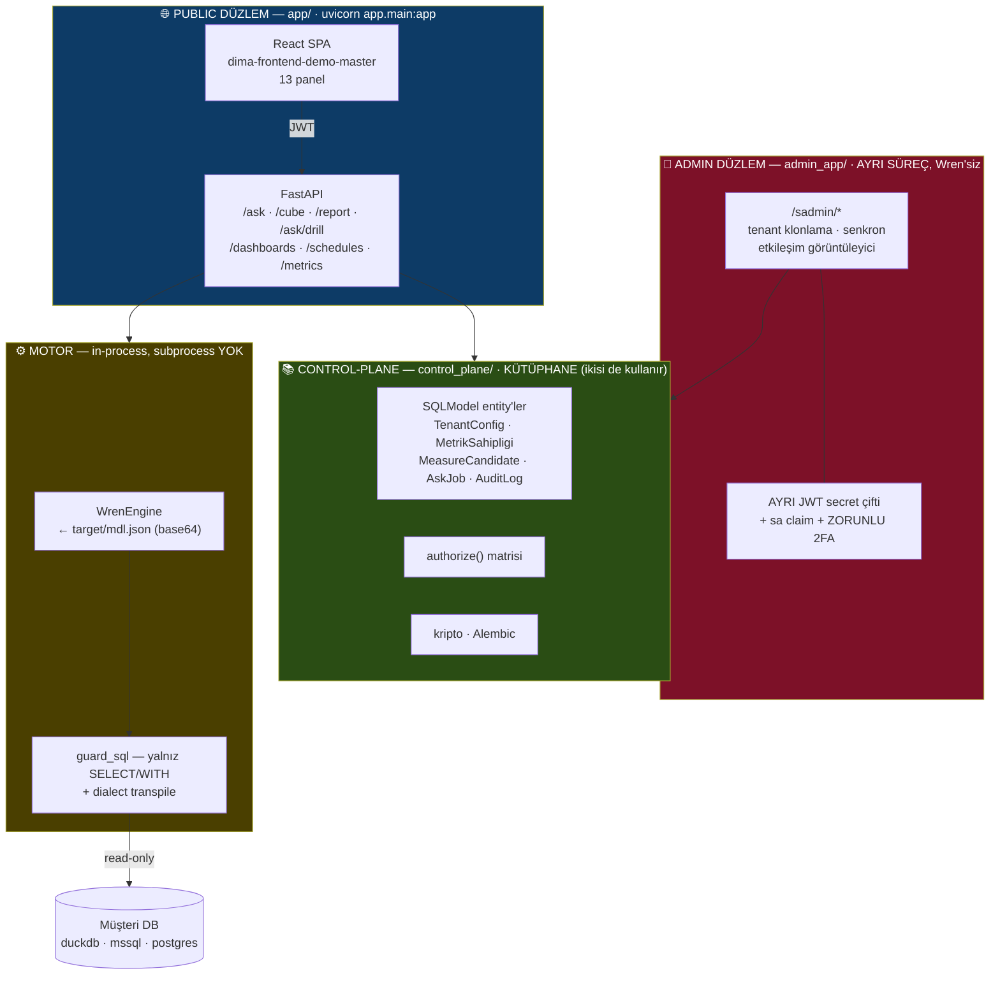

> ⚠ Ortak auth kodu **yalnız** `control_plane/`'de yaşar (ADR-0015 K1). Admin düzlemi **ayrı
> secret**la imzalar; ağ izolasyonu deploy katmanındadır.

**Veri akışı — tek yön:**

```
                 Müşteri DB (duckdb | mssql | postgres | …)
                        ▲   read-only · guard_sql (SELECT/WITH) · dialect transpile
                        │
                 WrenEngine (in-process)  ← target/mdl.json (base64)
                        ▲
                 compose()  ⟵ packs/kaynak ⊕ packs/modul ⊕ packs/sektor
                                ⊕ kesişim ⊕ packs/cekirdek ⊕ companies/<slug>
                        ▲
                 materialize()  ⟵ control-plane DB (TenantConfig)
                                    [DB → dosya, TEK YÖNLÜ]
```

---

# 2. Yedi katman — v1 sonundaki hâli

**Bu yeni bir mimari DEĞİL** — var olanın adlandırılmasıdır. Kusurların hepsi **katman
karışmasından** doğuyor; ayrıştırma bunun içindir.

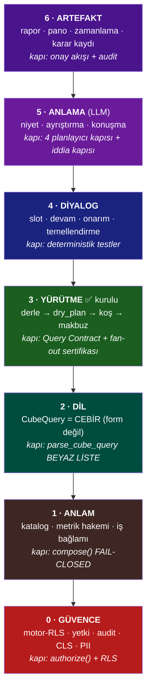

**Temel kural (`KAT-1`):** *her katman TEK iş yapar, TEK kapısı olur, altındakine yalnız
o kapıdan dokunur.*

### Katman × madde × durum

| # | Katman | v1'deki maddeler | Durum @`eb48c40` |
|---|---|---|---|
| **6** | ARTEFAKT | `6.1` onay akışı · `6.2` yazma araçları · `AJ6` bileşik rapor | 🔵 FAZ 6 — **yapılmadı** |
| **5** | ANLAMA | `AJ1` iddia kapısı · `AJ3` tur yöneticisi · `AJ5` planlayıcı | 🔵 §G — **yapılmadı** |
| **4** | DİYALOG | `AJ0b` diyalog yöneticisi | 🔵 §G — **atlanmış katman** |
| **3** | YÜRÜTME | — | ✅ **kurulu** |
| **2** | DİL | `AJ2` referans cebiri | 🔵 §G — **yapılmadı** |
| **1** | ANLAM | `0.18` metrik hakemi · `2.1` çekirdek katman · `2.2b` yüzey | ✅ **indi** *(bayrak `off`)* |
| **0** | GÜVENCE | `1.1` RLS · `1.2` CLS · `1.3` yetki · `1.8` audit · `1.12` AI Act | ✅ **indi** *(CLS kilitli — §13)* |

### v1'de GERÇEKTEN yeni olan yalnız dört şey

```
┌──────────────────────────────────────────────────────────────────┐
│  1 · app/iddia.py        → "olmayan yetenek vaadi" kapısı  [YOK] │
│  2 · diyalog katmanı     → slot · onarım · temellendirme   [YOK] │
│  3 · referans cebiri     → compare'in bileşimsel hâli      [YOK] │
│  4 · R11 red kodu        → "ifade edemiyorum" ≠ "anlamadım"[YOK] │
└──────────────────────────────────────────────────────────────────┘
  Geri kalan her şey ya KURULU ya YAZILIP KAPALI.
```

### Dört mimari kural — `KAT-1…KAT-5`

| Kural | İçerik | Neyi engeller |
|---|---|---|
| **`KAT-1`** | Bir mekanizma **iki iş yapmaz**. Yapıyorsa ikiye ayrılır, her birinin **kendi kapısı** olur | `compare` = eksen + kapalı küme → 7 dosyada kod |
| **`KAT-2`** | **Cevapsız bir dal, cevaplı bir yolu KESEMEZ.** `source=None` dönen dal `return` etmez — kendini **aday** kaydeder | yazım-benzerliği chip'i Discovery'yi kesiyordu |
| **`KAT-3`** | Bir katman, **kendisini besleyen katmandan önce** inşa edilmez | metrik kaydı 2.2'deydi → 0.18'e çekildi (3 ihlal bulundu) |
| **`KAT-4`** | **Kazanç ve gerileme FARKLI ALETLERLE** ölçülür | `--ab` ↔ `--ab-kurtarma` ayrımı |
| **`KAT-5`** | 🔴 **SAYMA — KAPAT.** Kullanıcıya dönük anlam ekseni **literal kümeyle** tanımlanamaz | *"Bir case veriyorum, bin açık çıkıyor"*ın mekanik sebebi |

> 🔴 **`KAT-5` neden kök teşhis:** bulunan **her** kusur, sayılarak tanımlanmış bir küme.
> `("yoy","mom")` · `FACT_ICON` sözlüğü · `TUR_*` 5 tür · `R1…R10` · SSE `adim|tamam|hata`
> · `AskJob.status` 4 değer · `_META_HINTS` alt-dize listesi.
> **Vaka sayısı sonsuz; kapı sayısı sonlu.**

---

# 3. Derleme zinciri — bir katalog nasıl doğar

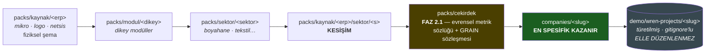

### `compose()` sadece kopyalamaz — **DÖRT üreteç** semantik YAML sentezler

| Üreteç | Ne üretir |
|---|---|
| `_merge_cube_synonyms` | mevcut cube metadata'sını **yeniden yazar** |
| `_compose_derived_metrics` | **yeni view + cube** üretir |
| `_compose_relationship_dimensions` | ilişkiden boyut türetir |
| `_compose_kpis` | çapraz-cube KPI'ları yükler |
| **`_merge_cube_metadata`** *(FAZ 2.1 — 5.)* | **anahtar düzeyinde** birleştirir |

> 🔴 **FAZ 2.1'in çözdüğü kusur:** `compose()` katmanları `shutil.copy2` ile **dosya
> düzeyinde** eziyordu — yani bir çekirdek katman yazılsa ERP katmanı onu **sessizce
> silerdi**. Beşinci üreteç birleştirmeyi anahtar düzeyine taşıdı.
> ⚠ **Yalnız `synonyms` + `unit` birleşir — `additive` ve `expression` BİRLEŞMEZ.**

### Grain sözleşmesi kapısı — fail-closed

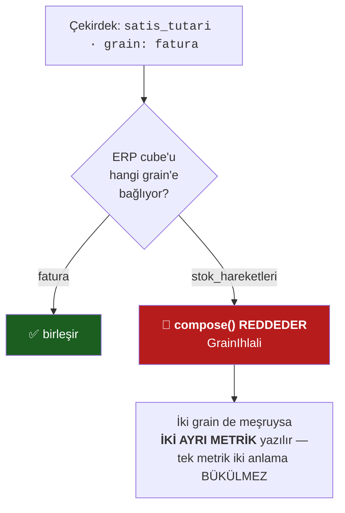

**Ölçülen yangın:** `ticaret` üç ERP'de aynı ad, aynı sinonim, aynı ölçü adı
(`satis_tutari`) — ama mikro'da `stok_hareketleri`, logo/netsis'te `faturalar` grain'inde.
**Üç şirkette karşılaştırılamaz üç sayı, hiçbir yerde beyan yok.**

---

# 4. 🔴 Bir prompt girildiğinde — TAM AKIŞ, tüm dallar

Bu, `app/routers/ask.py::ask()`'in **tam dallanmasıdır**. Sıra **bağlayıcıdır**; yeni
basamak eklemek `MIMARI.md`'nin güncellenmesini gerektirir.

## 4.1 · Üst düzey akış

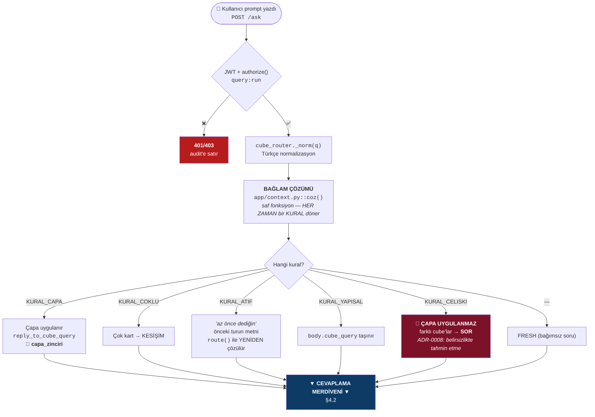

## 4.2 · Merdiven — 8 basamak, tüm çıkışlar

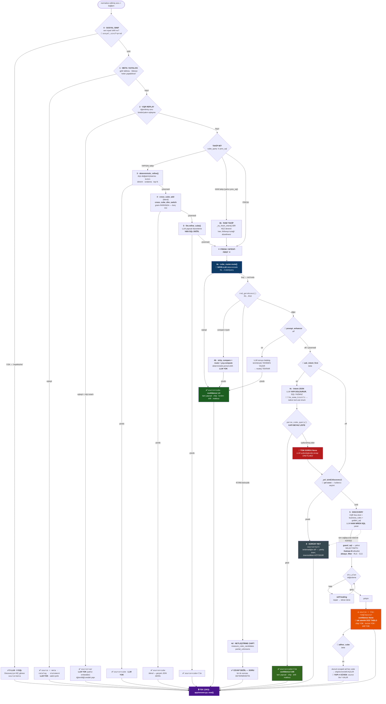

## 4.3 · Çıkış kapısı — `seal()` neden TEK


> **Neden modül düzeyinde:** eskiden `ask()` içinde bir **closure**'dı. Bu, **beş ihlalin
> ortak kök nedeniydi** — `/cube` paralel bir zincir yazmıştı, contract kaydını
> `except: pass` ile yutuyordu, `_try_kpi()` zinciri tamamen atlıyordu, üç ayrı contract
> kaydedici vardı, hiçbiri izole test edilemiyordu.
> **Kilit:** `tests/test_kapanis_zinciri.py`

## 4.4 · LLM sağlayıcı zinciri

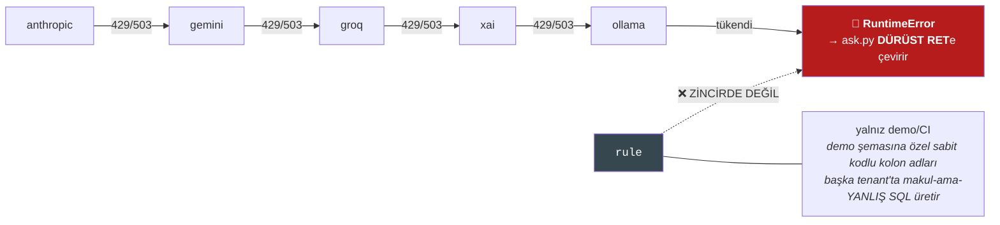

**Değişmez:** `_llm_source()` `rule`'u **asla deterministik gibi etiketlemez**.
Intent-JSON için ayrı ve **daha ucuz** bir model kullanılabilir (`*_select_model`).

## 4.5 · Aynı prompt, farklı ihtimaller — somut tablo

| Prompt | Beklenen dal | `source` | LLM | Chip/drill |
|---|---|---|---|---|
| `teşekkürler` | 0 · sosyal sınıf | `meta` | ❌ | — |
| `neler yapabilirsin` | 1 · katalog | `catalog` | ❌ | — |
| `gelir tablosu` | 1 · statement | `statement` | ❌ | — |
| `bu yıl satış tutarı` | 3 · route() | `cube` | ❌ | ✅ |
| `bu yıl satış tutarı cari bazında` | 3 · route() | `cube` | ❌ | ✅ |
| `geçen yıla göre ciro` | 4b · yoy | `cube` | ❌ | ✅ |
| *(kart üstünde)* `makine bazında ayır` | 3 · deterministic_refine | `cube` | ❌ | ✅ |
| *(kart üstünde)* `bir de fire ekle` | 4 · cross_cube_add | `cube` | ❌ | ✅ |
| `bu yıl bakiye` | 4d · **belirsizlik** *(cari ∣ mizan)* | chip | ❌ | soru |
| `hasılatımız` | 4c · Intent-JSON | `cube+llm` | ✅ | ✅ |
| `depo bazında satış` *(depo yok)* | 4d · **kısmi anlama** | chip | ❌ | soru |
| `acik borc` *(typo)* | ⚠ **yazım-benzerliği** — `AJ0` | `NOTE` | ❌ | 🔴 **merdiveni KESİYOR** |
| kapsam dışı serbest soru | 5 · Discovery | `llm:gemini` | ✅ | ❌ *(adhoc_cube hariç)* |
| hiçbiri | 8 · dürüst ret | `null` | — | — |

> 🔴 **`AJ0` — MIMARI §5'in 18. yasağı, HENÜZ İNMEDİ.** Yazım-benzerliği chip'i bugün
> **iki iş** yapıyor: *öneri üretmek* **ve** *merdiveni bitirme yetkisi*. Korpusta bu
> ölçüldü: `acik borc` → *"«cari borc» mi demek istedin?"* → Discovery'ye **hiç gidilmiyor**.
> Bu, `KAT-2`'nin doğrudan ihlali.

---

# 5. Cevaplama merdiveni — 8 basamak (normatif)

| # | Basamak | `source` | LLM? | Taşıdığı garanti |
|---|---|---|---|---|
| 1 | meta · katalog · gelir tablosu/bilanço | `meta` `catalog` `statement` | ❌ | sabit içerik |
| 2 | VQR replay | `vqr` | ❌ *(yalnız embedder)* | öğrenildiği andaki yapı |
| 3 | 🔴 **`cube_router.route()`** — sıfır-LLM | **`cube`** | ❌ | **tam yapısal · chip · kırılım · drill · Query Contract** |
| 4 | `deterministic_refine()` — yapısal takip | `cube` | ❌ | aynı |
| 5 | `cross_cube_add` / `cross_cube_dim_switch` | `cube` | ❌ | aynı *(blend, gerçek JOIN değil)* |
| 6 | 🔴 **Intent-JSON** — LLM **yapı doldurur, SQL YAZMAZ** | **`cube+llm`** | ✅ *(küçük model)* | **tam yapısal · chip · kırılım · drill · Query Contract** |
| 7 | ⚠️ **Discovery** — LLM ham SQL yazar | `llm:<sağlayıcı>` | ✅ | **tek atımlık düz tablo. Chip YOK, kırılım YOK, drill YOK** |
| 8 | dürüst red | `null` | — | *"anlamadığını bil"* |

### 5.1 · Basamak 3 ve 6 neden **aynı** garantiyi taşıyor

İkisi de aynı **yapısal `CubeQuery`** üretir ve aynı **deterministik derleyici** SQL'e
çevirir. LLM'in katkısı yalnız **alan seçimi**dir.

```
parse_cube_query()  =  KATI BEYAZ LİSTE
   bilinmeyen cube      ─┐
   bilinmeyen ölçü      ─┤
   bilinmeyen boyut     ─┼──►  TÜM SORGU None
   bilinmeyen zaman b.  ─┤     (LLM uydurduğunda cevap ÜRETİLMEZ)
   bilinmeyen filtre    ─┘
```

### 5.2 · Discovery neden **ölü** ve neden **istisna**

```
cube_query üretmez  →  next_steps         BOŞ
                    →  recommendations    BOŞ
                    →  calculation_explanation BOŞ
                    →  /ask/drill  DÜRÜSTÇE REDDEDER (sahte dallanma uydurmaz)
```

**Ölçülen prod maliyeti:**

| Yol | Süre | Token |
|---|---|---|
| Discovery | **12.567 ms** | **24.352 input** |
| Aynı tenant'ın **cube** yolu | **145–434 ms** | **0** |

> **Her Discovery cevabı, belgelenmiş bir kapsam boşluğudur ve bir terfi adayıdır.**
> *(Araştırma doğruluyor: durumsuz çok-turlu text-to-SQL 3. turda **sıfır doğruluğa**
> çöküyor — EnterpriseMem-Bench, 2026-05.)*

---

# 6. Red kodları — R1…R10 (ve eksik R11)

`app/cube_router.py` · `red_gerekcesi()` ile okunur.

| Kod | Anlamı | Kullanıcıya dönüşü |
|---|---|---|
| `R1` | cube eşleşmedi | Discovery ∨ dürüst ret |
| `R2` | liste/döküm niyeti *(politika: küp üretebilir ama devredildi)* | 🚩 `liste_niyeti=beta` → kırılım |
| `R3` | kıyas dili (`compare`) — cube yolu kıyası kurmuyor | `yoy.compute` dalı |
| `R4` | ölçü eşleşmedi | netleştirme ∨ Discovery |
| `R5` | ortalama istendi ama ortalama ölçü tanımlı değil | dürüst ret |
| `R6` | dışlama filtresi **kısmen** çözüldü *(yarım uygulama yapılmaz)* | dürüst ret |
| `R7` | **boyut adayı tek değil** → belirsizlik | 🔵 **netleştirme chip'i** |
| `R8` | yarı-toplanabilir ölçü + zaman kovası *(running balance = WINDOW)* | 🔵 netleştirme |
| `R9` | kırılım istendi ama boyut eşleşmedi | netleştirme |
| `R10` | **kapsam kapısı** — tanınmayan kelime (ADR-0008) | dürüst ret |
| 🔴 `R11` | **YOK — v1'de yazılacak**: *"ifade edemiyorum"* ≠ *"anlamadım"* | **eksik yetenek SAYILAMIYOR** |

### Risk-kapsam eğrisi — kapılar üstünde, skaler `confidence` **UYDURULMADAN**

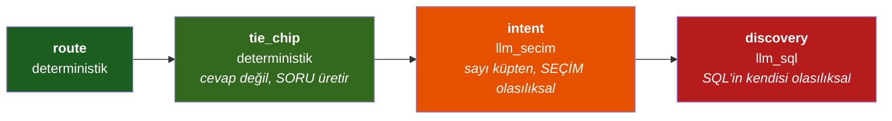

> 🔴 **`hata_orani` bilerek YOK** — bir kapının hata oranını bu araç ölçemez (doğruluk
> korpusun işi). Yazsaydık **uydurma** olurdu.
> ⚠ **`consistency_k` bir güven eşiğine DÖNÜŞTÜRÜLMEZ:** *"bir model son derece
> self-consistent olup yine de **tutarlı biçimde YANLIŞ** olabilir."*
> **Araç:** `lab/risk_kapsam.py` → `lab/reports/risk_kapsam.md`

---

# 7. Bayrak envanteri — 25 bayrak, tam durum

**Kapsam sırası (soldan sağa artar, en spesifik kazanır):**

```
global (demo/packs/features.yml)  <  sektör  <  şirket  <  DB-override
                                                          (global-scope < sektör < tenant < rol < kullanıcı)
```

**Aşamalar:** `off` → `alpha` → `beta` → `prod`
*`beta` = herkese kapalı DEĞİL; varsayılanda yalnız burada tanımlı, admin panelden
tenant/rol/kullanıcı override'ı ile açılır.*

## 7.1 · `features.yml`'de tanımlı 21 bayrak

| Bayrak | Durum | Faz | Ne yapar | Kapalıyken |
|---|---|---|---|---|
| `sosyal_sinif` | 🟢 **prod** | 0.13 | veri-niyeti yok → 0 LLM · 0 SQL | `teşekkürler` **uydurma SQL** üretir |
| `cikti_yorumlama` | 🔵 beta | — | her tablo/grafik/rapor/KPI için deterministik yorum | yorum yok |
| `sql_display` | 🔵 beta | — | üretilen SQL'i kullanıcıya aç | gizli |
| `verify_button` | 🔵 beta | — | ✓/✗ doğrulama → VQR öğrenmesi | öğrenme yok |
| `scheduled_reports` | 🔵 beta | — | zamanla + bildirim (ADR-0011) | uç yok |
| `dashboards` | 🔵 beta | §9 | kullanıcı panoları — canlı izleme | pano yok |
| `next_steps` | 🔵 beta | K2 | kırılım/ölçek/zaman chip'leri | chip yok |
| `ask_intent_first` | 🔵 beta | 1 | route() boşsa **Intent-JSON** doldurt | Discovery'ye düşer |
| `llm_sema_kisitli` | 🔵 beta | 3a | Intent-JSON'u **native tool-use** enum'una taşı | serbest-JSON yedeği |
| `metrik_kaydi` | 🔵 beta | **0.18** | **HAKEM** — bir terimi 2 cube sahipleniyorsa | kayıt **şemaya HİÇ yazılmaz** |
| `liste_niyeti` | 🔵 beta | 2a-5 | *"listele/dökümü"* → cube kırılımı | dejenere **tek toplam** *(sessiz-yanlış)* |
| `adhoc_cube` | 🔵 beta | 1/K1 | Discovery sonucundan **oturum-scoped cube** | Discovery'de chip/drill yok |
| 🔴 `kapsam_mercegi` | ⚫ **off** | **2.3** | departman = **mercek**, küp değil | herkes TAM katalogu görür |
| 🔴 `ossie_ithal` | ⚫ **off** | **3.4** | Apache Ossie semantik model ithali | uç **404** |
| 🔴 `agent_plan_secimi` | ⚫ **off** | **4/AJ5** | `Planlayici.sec()` planı **ÖNERİR**, 4 kapı denetler | pilot yok |
| 🔴 `prompt_enhancer` | ⚫ **off** | **3b** | route() boşsa soruyu **yeniden yaz**, route()'u tekrar dene | sıcak yolda LLM yok |
| 🔴 `capa_zinciri` | ⚫ **off** | **0.5** | karta yanıt **kimliğiyle** taşınır | `capalar` boş → bugünkü dallar |
| 🔴 `tazelik` | ⚫ **off** | **1.7** | *"bu sayı ne kadar eski?"* — 4 kademe | alanlar `None` |
| 🔴 `metrik_sertifikasi` | ⚫ **off** | **1.5** | tanımı **KİM** onayladı + o günden beri değişti mi | rozet yok *(⚠ hash çürümesi **kapalıyken de işler**)* |
| 🔴 `lineage` | ⚫ **off** | **1.6** | **KOLON** düzeyi köken | makbuz bugünküyle birebir |
| 🔴 `netlestirme_onceligi` | ⚫ **off** | **F/0.4** | ≥2 sahipli ölçüde chip Intent-JSON'u **önceler** | Intent-JSON gölgeliyor |

## 7.2 · `FLAG_REGISTRY`'de var, `features.yml`'de YOK — 4 bayrak

| Bayrak | Neden YAML'de yok | Nasıl açılır |
|---|---|---|
| `cekirdek_katman` | 🔴 **derleme-zamanı ayarı**, tenant bayrağı değil — `compose()`'un `principal`'ı yok | `app/config.py:184` · `DIMA_CEKIRDEK_KATMAN=on` + **yeniden derleme** |
| `ayni_grain_gocu` | aynı sebep — compose katmanında | `off\|shadow\|on` |
| `ask_async_discovery` | 🔴 **ÖLÜ BAYRAK** — §C/10'un ölçtüğü 2 taneden biri | kayıtta var, YAML'de yok |
| `threaded_chat` | 🔴 **ÖLÜ BAYRAK** — ikincisi | kayıtta var, YAML'de yok |

> 🔴 **§C ölçüt 10 hedefi: ölü bayrak = 0.** Bugün **2**.
> Ölçüm: `FLAG_REGISTRY` **25** ↔ `features.yml` **21**.

## 7.3 · Yol haritasında adı geçen ama **kayıtta OLMAYAN** bayraklar

| Roadmap'te yazan | `FLAG_REGISTRY` | Gerçek durum @`eb48c40` |
|---|---|---|
| `hedef_kiyasi` *(2.5)* | ❌ **yok** | ⚠ **`app/hedef.py` indi ve `answer.py:647`'den ÇAĞRILIYOR — ama bayrak kayıtta yok.** Kapı **beyanın kendisi**: `target:` yoksa çizgi `Ort.` kalır. *Bu, belgenin `[DOĞRULANMADI]` demesi gereken cinsten bir ayrışmadır — kaynağı koş, belgeye güvenme.* |
| `ui_metrik_yonetimi` *(2.2b)* | ❌ yok | yüzey indi, bayrak kayıtsız |
| `coldstart_metrik` *(3.6)* | ❌ yok | `app/coldstart.py` indi, bayrak kayıtsız |
| `netlestirme_kapanisi` *(0.5b)* | ❌ yok | — |
| `motor_rls` *(1.1)* · `motor_cls` *(1.2)* | ❌ yok | env/config yoluyla |
| `onay_akisi` *(6.1)* · `yazma_araclari` *(6.2)* | ❌ yok | **FAZ 6 — yapılmadı** |
| `ossie_ihrac` *(4.4)* · `mcp_yuzeyi` *(4.5)* | ❌ yok | **FAZ 4 — sırada** |
| `tur_takip` *(5.1)* · `tur_paylas` *(5.2)* | ❌ yok | **FAZ 5** |
| `peer_kiyasi` · `kpi_pin` · `hizli_derin` · `netlestirme_duzeyi` *(FAZ 5)* | ❌ yok | **FAZ 5** |
| `kanal_slack` · `kanal_whatsapp` · `sabah_digest` *(5.9)* | ❌ yok | **FAZ 5** |
| `public_api` · `embed` *(6.5)* · `kanal_kimlik` *(6.6)* | ❌ yok | **FAZ 6** |
| `ui_settings_tam_sayfa` · `ui_kanit_gorunurlugu` · `ui_dcm_modu` *(FAZ 7)* | ❌ yok | **FAZ 7** |
| `diyalog` · `referans_dili` · `tur_yoneticisi` · `calisirken_sorma` · `oturumlar_arasi_hafiza` · `adim_zinciri` · `bilesik_rapor` *(§G)* | ❌ yok | **§G — v1'e paralel** |

## 7.4 · Bayrak profilleri (`0.20`)

| Profil | İçerik | Ölçülen |
|---|---|---|
| `taban` | **hepsi off** | **0 açık** |
| `v1-varsayilan` | v1'in önerilen hâli | **11/17** |
| `v1-tam` | hepsi açık | **19/19** |

---

# 8. 🔴 Manuel test edilecek her şey — `off` bayraklar

**Neden manuel:** aşağıdaki dokuz bayrağın hiçbirinin kazancı **korpusla ölçülemez**.
Korpus soruları **katalogdan üretiliyor** ve beklenen cevap da **katalogdan** türetiliyor —
yani sinonim zenginleşmesi, tazelik rozeti, kolon kökeni gibi şeyleri **göremez**.
*Cetveli uzatıp "bak uzamamış" demek olur.*

> 🔴 **Bu tablonun sebebi ölçülmüş bir hatadır:** `cekirdek_katman` bayrağı bir kez
> *"kazanç ölçülemedi"* diye `off` bırakıldı. Yanlış karardı — **alet o soruyu ölçemiyordu.**
> Doğru cevap *"kazanç yok"* değil, **"bu alet bu soruyu ölçemez"**di.

## 8.1 · Test protokolü — her bayrak için aynı üç kutu

```
┌─ 1 · KAZANÇ ─────────────────────────────────────────────┐
│  Açıkken NE ÇALIŞMALI? (yazılı, önceden, yanlışlanabilir)│
├─ 2 · KIRMIZI ÇİZGİ ──────────────────────────────────────┤
│  NE KESİNLİKLE DEĞİŞMEMELİ? (ihlal → bayrak ANINDA kapanır)│
├─ 3 · GİZLİ RİSK ─────────────────────────────────────────┤
│  Nereye bakmalısın ki sessiz bozulmayı yakalayasın?      │
└──────────────────────────────────────────────────────────┘
```

## 8.2 · Bayrak bayrak — ne sorulacak, ne beklenecek

### 🔴 `cekirdek_katman` *(FAZ 2.1 — derleme zamanı)*

| | |
|---|---|
| **Nasıl açılır** | `DIMA_CEKIRDEK_KATMAN=on` + **konteyner yeniden başlat** *(UI düğmesi YOK — `compose()`'un principal'ı yok)* |
| **1 · Kazanç** | `hasılat` · `hasilat` · `gelir` → satış tutarı · `kalan` · `hesap bakiyesi` → bakiye · `borç toplamı` · `toplam borç` → borç · `kaç hareket` · `işlem sayısı` → hareket sayısı. **Bugün cevapsız kalanlar açıkken CEVAPLANMALI** |
| **2 · Kırmızı çizgi** | 🔴 **HİÇBİR SAYI DEĞİŞMEMELİ.** Gölge derlemede dört şirkette **sayı-etkisi 0 fark** ölçüldü — `expression` · `base_object` · `additive`'e dokunulmuyor |
| **3 · Gizli risk** | **Genişleyen bir sinonim başka küpün eşleşmesini ÇALABİLİR.** Cevabın **sayısına değil**, **hangi küpten geldiğine** bak → rozet / `source` / `explain` |
| **Ölçülen** | gölge diff: 4 şirkette sayı-etkisi **0**, sözlük büyümesi **2/8/5/7** |

### 🔴 `kapsam_mercegi` *(FAZ 2.3)*

| | |
|---|---|
| **1 · Kazanç** | Departman kullanıcısı `/schema`'da **yalnız kendi merceğini** görür; `genel` ve `portfoy` ayrı |
| **2 · Kırmızı çizgi** | 🔴 **Mercek bir GÖRÜNÜRLÜK aracıdır, GÜVENLİK SINIRI DEĞİL.** Kapatmak **yetki AÇMAZ**. `portfoy` yalnız `is_superadmin` ile |
| **3 · Gizli risk** | Merceğin `/ask`'e sızması — **`AskRequest.scope` bilerek YOK**; mercek `/schema`'ya ait |
| ⚠ **YAML tuzağı** | `kapsam_mercegi: off` **tırnaksız yazılırsa YAML 1.1 onu BOOLEAN okur** |

### 🔴 `tazelik` *(FAZ 1.7)*

| | |
|---|---|
| **1 · Kazanç** | Her cevapta `taze \| uyarı \| hata \| bilinmiyor` kademesi |
| **2 · Kırmızı çizgi** | 🔴 **`hata` VE `bilinmiyor` kademelerinde SAYI GÖSTERİLMEZ** |
| **3 · Gizli risk** | ⚠ **Demo/DuckDB tenant'larında `SyncState` YOK** → hepsi `bilinmiyor` → **sayı gizlenir**. Açmak bir **ÜRÜN kararıdır** ve **tenant başına** ölçülmelidir |

### 🔴 `metrik_sertifikasi` *(FAZ 1.5)*

| | |
|---|---|
| **1 · Kazanç** | Rozet: metriğin tanımını **kim** onayladı |
| **2 · Kırmızı çizgi** | ⚠ **TANIM-HASH ÇÜRÜMESİ KAPALIYKEN DE İŞLER** — aksi hâlde bayrak açıldığında **bayat** sertifikalar *"geçerli"* görünürdü |
| **3 · Gizli risk** | Onaydan sonra `expression` değişmişse rozet **düşmeli**; düşmüyorsa sessiz-yanlış |

### 🔴 `lineage` *(FAZ 1.6)*

| | |
|---|---|
| **1 · Kazanç** | *"Bu sayı hangi tablonun hangi kolonundan, hangi **dönüşümle** geldi?"* |
| **2 · Kırmızı çizgi** | Kapalıyken makbuz bugünküyle **BİREBİR** |
| **3 · Gizli risk** | `answer.koken()` **İLİŞKİ** düzeyindedir (hangi kırılım hangi join'den) — bu ondan **FARKLI** bir sorudur ve **yerine geçmez**. İkisi karıştırılırsa kullanıcı sahte bir kesinlik görür |
| **Not** | Toplanan geçmiş **SİLİNMEZ** (ADR-0019) |

### 🔴 `capa_zinciri` *(FAZ 0.5)*

| | |
|---|---|
| **1 · Kazanç** | Bir **karta yanıt** verirken bağlam o kartın kimliğiyle taşınır. Çok kart → **kesişim** |
| **2 · Kırmızı çizgi** | 🔴 Farklı cube'lu kartlar seçilirse → **`KURAL_CELISKI` → SOR**. Sessizce birini seçmek yasak (ADR-0008) |
| **3 · Gizli risk** | 🔴 **Ölçülen kusur:** `coz()` doğru kuralı üretiyordu ama takip zinciri hâlâ `body.cube_query`'yi okuyordu → **çapa çözülüp yok sayılıyordu**. Kullanıcı için sonucu: işaret ettiği karta yanıt verirken cevap **başka bir raporun** bağlamına kayıyor — **sessizce**. Açtığında **buna** bak |

### 🔴 `netlestirme_onceligi` *(FAZ F / 0.4)* — **ÖLÇÜLDÜ, `off` KALIYOR**

| | |
|---|---|
| **Ölçüm (CANLI)** | A/B 63 etiketli vaka: **bozulan 0 · kurtarılan 0** · Kurtarma 15 gerçek ifade: cevaplanan **12 → 8**, kurtarılan **1** *(doğru ölçüyle **0**)*, **kaybedilen 5** · Kararlılık: **5/6 kararlı** |
| **Karar** | Kabul ölçütü *(doğru kurtarma > 0)* **karşılanmıyor** ve kayıp gerçek → **KAPALI** |
| **Kararın evi** | 🔴 **`MIMARI.md` §7** — bir YAML yorumu mimari otorite **değildir**. `test_faz0_4_netlestirme.py` iki yerin **ayrışmasını** kapıya çevirdi |
| ⚠ **Yan bulgu** | `bu yıl bakiye` kararlı şekilde `mizan.bakiye` seçiyor ve cevap **₺0** — mizan yapısı gereği sıfıra denkleşir. Bu bir **MOTOR kusuru değil KATALOG kararıdır** *(bare `bakiye` hangi cube'un?)* ve **sessizce yamalanmadı** |

### 🔴 `prompt_enhancer` *(FAZ 3b)* — **ölçüldü, kazanç YOK, kota sınırına çarpıldı**

| | |
|---|---|
| **1 · Kazanç** | route() boşken soruyu katalog terimleriyle yeniden yaz → route() tekrar |
| **2 · Kırmızı çizgi** | 🔴 **LLM YAPI SEÇMEZ, yalnız METNİ iyileştirir.** Planlayıcının **dört kapısından** geçer *(route denenmeden seçilemez)* |
| **3 · Gizli risk** | **Sıcak yola LLM çağrısı ekliyor** — gecikme + kota. Açılması **bilinçli karar** olmalı |

### 🔴 `agent_plan_secimi` *(FAZ 4 / AJ5)*

| | |
|---|---|
| **1 · Kazanç** | `Planlayici.sec()` planı **ÖNERİR**; `agent_run` makbuzu kaydedilir |
| **2 · Kırmızı çizgi** | 🔴 **SEÇİM ≠ ÇALIŞTIRMA.** Dört kapı denetler |
| **3 · Gizli risk** | Sıcak yola LLM çağrısı |

### 🔴 `ossie_ithal` *(FAZ 3.4)*

| | |
|---|---|
| **1 · Kazanç** | Müşterinin var olan semantik modeli bir `packs/` katmanı olur; `ai_context` → `synonyms` |
| **2 · Kırmızı çizgi** | 🔴 **İthal edilen her ilişki `certified: "olculmedi"` damgasıyla gelir.** *İthal bir ilişki, sessiz "sağlıklı" DEĞİLDİR* |
| **3 · Gizli risk** | Adsız `dataset`/`metric`/`field`/`relationship` → **fail-closed REDDEDİLİR**, atlanmaz. Ve ithal **ÇEKİRDEK katmana** iner, ERP katmanına **değil** *(yoksa `cari`/`ticaret`'in dördüncü kopyası doğar)* |
| **Kapalıyken** | uç **404** döner |

## 8.3 · `beta` bayraklar — açık ama **hiç elle bakılmamış** olabilir

| Bayrak | Elle doğrulanacak |
|---|---|
| `metrik_kaydi` | Aynı terimi iki cube sahipleniyorsa **hakem** doğru mu? Tenant kararı yoksa davranış **birebir bugünkü** olmalı |
| `liste_niyeti` | *"listele/dökümü"* → gerçek boyut yoksa **dejenere tek toplam DÖNMEMELİ** |
| `adhoc_cube` | Discovery cevabında chip/drill açılıyor mu — **ve `source` hâlâ `llm:*` mi?** 🔴 **YAPI ≠ GÜVEN** |
| `llm_sema_kisitli` | Desteklenmeyen sağlayıcıda **serbest-JSON yedeğine** düşüyor mu? `cube:null` **reddetme dalı** korunuyor mu? |
| `next_steps` | Chip'ler **deterministik** mi, tıklanınca **yeni SQL üretmiyor** mu? |
| `dashboards` · `scheduled_reports` | Panel var mı, uç yetim değil mi? |

---

# 9. A/B testi yapılacak her şey

## 9.1 · 🔴 `KAT-4` — kazanç ve gerileme **FARKLI ALETLERLE** ölçülür

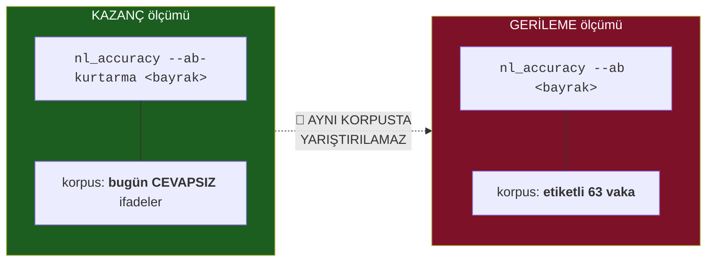

> **Neden:** etiketli vakalarda bir LLM bayrağı **kazanç ÜRETEMEZ**, yalnız **bozabilir**.
> Aynı korpusta yarıştırmak `50402d3`'ün *"YANLIŞ NÜFUS ölçülmüştü"* dersinin tekrarıdır.

## 9.2 · A/B kuyruğu — bayrak bayrak

| Bayrak | Kazanç aleti | Gerileme aleti | Kabul ölçütü | Durum |
|---|---|---|---|---|
| `netlestirme_onceligi` | `--ab-kurtarma` | `--ab` | doğru kurtarma **> 0** | ✅ **ölçüldü** → `off` *(kurtarma 0, kayıp 5)* |
| `prompt_enhancer` | `--ab-kurtarma` | `--ab` | kazanç > 0 | ⚠ **ölçüldü: kazanç YOK** *(kota sınırına çarpıldı)* |
| `llm_sema_kisitli` | `faz3a_sema_kazanci.py` | `--ab` | kazanç > 0 | ✅ **ölçüldü: 0 kazanç** — mekanizma **yapısal** gerekçeyle kaldı |
| `cekirdek_katman` | 🔴 **korpus ÖLÇEMEZ** → **manuel tur** | `mdl_diff` gölge derleme | **sayı-etkisi 0** + daha çok soru cevaplanıyor | ⬜ **HAKEM: KULLANICI** |
| `t2_anlatici` | `narration_guard` red/yayım **oranı** | süit | **0 uydurma sayı** | ⬜ FAZ 5 |
| `agent_plan_secimi` | **§G.6 kıyas sözleşmesi** | `--ab` | §G.6b | ⬜ §G |
| `ayni_grain_gocu` | 🔴 **korpus ÖNCESİ/SONRASI ZORUNLU** | korpus | **erişim DÜŞERSE GERİ ALINIR** | ⬜ *(bkz. §9.3)* |
| `motor_rls` | — | `logs/rls_shadow.jsonl` | **gölge 7 gün · sapma 0** | ⬜ FAZ 1 |
| `ossie_ihrac` | — | **round-trip** | ihraç→ithal → **birebir aynı SQL** | ⬜ FAZ 4.4 |
| `mcp_yuzeyi` | — | `tests/test_mcp.py` | MCP = HTTP: **aynı 4 kapı, aynı makbuz** | ⬜ FAZ 4.5 |

## 9.3 · 🔴 `ayni_grain_gocu` — **bu depoda bir kez REDDEDİLMİŞ işin ta kendisi**

```
ÖLÇÜLDÜ (bir kez denendi, geri alındı):
   surdurulebilirlik kimliğinden ham kaynak adları çıkarıldı
        ↓
   erişim  %64 ──────────────► %56
   sessiz-yanlış  110 KAPANDI
   cevap          388 KAYBOLDU
        ↓
   🔴 3,5 : 1  KÖTÜ TAKAS  →  GERİ ALINDI  →  ŞİMDİ TESTLE KORUNUYOR

TEŞHİS: "kimliği kaldırmak sahipliği ÇÖZMEDİ."
```

> **Bu yüzden korpus öncesi/sonrası ölçümü zorunlu olan TEK madde budur.**
> O 388'i **hiçbir manuel tur göstermezdi.**

## 9.4 · §G kıyas sözleşmesi — **ikinci satır kod yazılmadan ÖNCE yazıldı**

| Kural | İçerik |
|---|---|
| **G.6a** | 🔴 A ve B **AYNI KORPUSTA KIYASLANAMAZ** |
| **G.6b** | Kabul ölçütü **şimdi yazılır, sonra tartışılmaz** |
| **G.6d** | 🔴 **TEST REJİMİ — ÜÇ KATMAN, üçü de ZORUNLU** |
| **G.6e** | **`VK-1…VK-6`** adı konmuş kabul vakaları — geliştirici **ATLAYAMAZ** |
| **G.6f** | `N`'in değeri · **hakem protokolü** · ***"KOŞULAMADI" hükmü*** |
| **G.6c** | **Manuel test yolu** — kullanıcının açık isteği |
| **Teslim** | 🔴 ***"B kazanmadı"* de geçerli bir sonuçtur. Kararın kendisi bir teslimdir** |

---

# 10. Test kapıları — ne ölçüyor, ne ölçemiyor

## 10.1 · Dört kapı, iki rejim

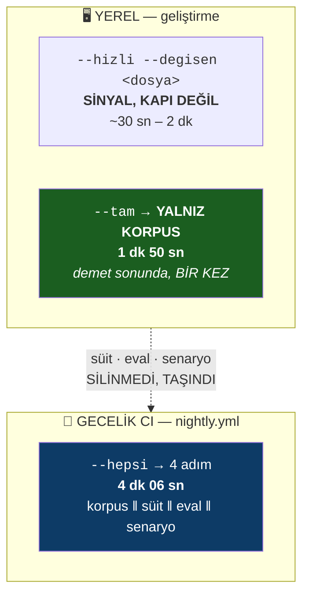

**Neden daraltıldı — ölçüldü:**

| Adım | Bu operasyonda kaç kez kırmızı verdi | Süre |
|---|---|---|
| `eval.run` | **0** — her koşumda `+0,0 / +0,0 / +0,0` | ~1,5 dk |
| konuşma senaryoları | **0** — dokuz sınıf tabanda sabit | ~1,5 dk |
| tam süit | birkaç kez — ama **aynı kusurları `--hizli` de yakaladı** | ~8,5 dk |
| 🔴 **korpus** | **1 kez — ve kimsenin göremeyeceği bir kusuru yakaladı** | **1 dk 57 sn** |

> **Korpusun tek yakalaması:** `gitas` korpustan **tamamen düştü**, payda **445 → 342**'ye
> indi ve doğruluk *"yükseldi"*. `eval` yeşildi, senaryolar yeşildi — çünkü hiçbiri
> ***"kaç soru cevaplanabiliyor"*** sorusunu sormuyor.

**İki dalga zorunluluğu:** korpus (10 süreç) ile süit (8 worker) **aynı anda compose**
yaptı → 20 çekirdek yetmedi → derleme kilidi **60 sn zaman aşımı** → süit **934 hata**.
`--hepsi` bu yüzden **iki dalga** koşar.

## 10.2 · Her kapı neyi ölçer — ve neyi **ÖLÇEMEZ**

| Kapı | ÖLÇER | 🔴 **ÖLÇEMEZ** |
|---|---|---|
| **korpus** (`nl_corpus.py --kapi`) | *"kaç soru cevaplanabiliyor"* · doğru cube oranı · semantik vaka | 🔴 **YANLIŞ YAZILMIŞ soruları** *(sorular katalogdan üretiliyor → hepsi doğru yazılmış → typo yolu HİÇ sorulmuyor)* · **sinonim zenginleşmesini** *(beklenen cevap da katalogdan türetiliyor)* · **cevabın DOĞRULUĞUNU** *(yalnız cube seçimi)* |
| **süit** (`pytest`, **2477+ test**, 194 dosya) | davranış regresyonu | ⚠ **METNİ ölçen testler** — bu operasyonda **10 kez** kendi belgesini/assert satırını yakaladı, hepsi **AST kontrolüne** çevrildi |
| **eval** (`eval.run`) | regresyon kilidi | 🔴 MIMARI §7'nin kendi ifadesiyle *"**zaten çalışan şeye göre kuratörlenmiş**"* — yeni kazanç göremez |
| **senaryo** (`konusma_senaryolari.py`) | dokuz konuşma sınıfı | ⚠ senaryo tümden çökse bile **hiçbir koşulda kırmızı veremez** *(ölçüldü: `returncode == 0`)* |
| **`--hizli`** | değişen modüle **import bağımlı** testler | 🔴 **BİR KAPI DEĞİL, BİR SİNYAL** — davranışa dayanan test **kaçabilir**. Merkezî dosyada küme patlar: `cube_router`+`wren_service` → **1326 test / 6 dk 15 sn** *(korpustan 3× pahalı)* |

## 10.3 · Ölçüm sözleşmesi — `D1…D5`

| Kural | İçerik |
|---|---|
| **D1** | `NE` **üç parçalıdır** *(backend · sözleşme · frontend)* ya da **`api-only` + gerekçe** |
| **D2** | Her sayı **`<sayı> @<sha> · <komut>`** taşır |
| **D3** | Kanıtlanmamış → **`[DOĞRULANMADI]`** |
| **D4** | Enabler, tüketicisinden **önce** *(`KAT-3`)* |
| **D5** | Taşınan madde **kütük bırakır**, silinmez |
| **⊘** | 🔴 **ÜÇÜNCÜ DURUM: `ÖLÇÜLEMEDİ`** — ne geçti ne kaldı |
| **KURAL A** | 🔴 **Donmuş payda dokunulamaz** *(`nl_corpus.py:141` — "ham tur paydası KORUNUR")* |
| **KURAL B** | 🔴 **Bayrak kapalı = BİREBİR aynı davranış**, ve bu **testle kilitlenir** |

## 10.4 · Koşum hijyeni — bağlayıcı

```bash
# TEK SEFERLİK: test imajı  (prod imaj + pytest)
docker build -t dima-api  -f Dockerfile      backend/
docker build -t dima-test -f Dockerfile.test backend/

# ⚠ Depo KÖKÜNDEN koşulur; frontend mount'u ZORUNLU
#   (yoksa yetim-uç kapısı SESSİZCE atlanır)
docker run -d --name dima-k1 --network none \
  -v "$PWD:/repo" -w /repo/backend \
  -e DIMA_VQR_EMBEDDER=off dima-test \
  python lab/kapi.py --tam
docker wait dima-k1 && docker logs dima-k1 && docker rm -f dima-k1
```

| 🔴 Yasak | Sebep |
|---|---|
| **İki test konteynerini paralel koşturmak** | compose kilidi `metadata.yml`'de çakışır *(per-process aynalar geldi ama "aynı ağaca iki süreç giremez" durur)* |
| **Kapı koşarken repoya yazmak** | mount **canlı** |
| `--rm` ile koşmak | log okunamaz → `-d` + `--name` + `docker wait` |
| Payda seyreltmek | **payda kutsaldır** |

---

# 11. v1 bitiş ölçütleri — 16 satır

**12 iç kalite + 4 kullanıcı sonucu.** Üreteç: `backend/lab/faz0_taban.py`.

## 11.1 · İç kalite (1–12) — üreteç ölçer

| # | Ölçüt | Bugün @`0619bfd` | v1 hedefi |
|---|---|---|---|
| 1a | Sessiz-yanlış — **yanlış cube** | **458/7213 = %6,3** | azalır |
| 1b | Sessiz-yanlış — doğru cube üretilemedi | **493/7213 = %6,8** | azalır |
| 1c | **`YANLIS-OK`** (gürültüye SQL) | **7** | **artmaz** |
| 2 | **Doğrudan cevap (OK)** | **7580/10865 = %69,8** | artar |
| 3 | **`CLARIFY:dönem`** | **1478/10865 = %13,6** | 🔴 **DEĞİŞMEZ (±0,5)** — değişirse ADR-0007 K3 **delinmiş** |
| 4 | **Motor-seviyesi RLS** | **0** | `on` · **gölge 7 gün · sapma 0** |
| 5 | **Yetki granülerliği** | 15 araç · **15/15 `query:run`** | araç başına **gerçek aksiyon** |
| 6 | **Onaysız yazma** | yazma aracı **0** · onay akışı **YOK** | **imkânsız** + audit + **30 dk süre aşımı** |
| 7 | **Yetim uç / alan** | **⊘ ÖLÇÜLEMEDİ** | **0** · K1-K5 **kör noktasız** |
| 8 | **Ölçüm kapıları CI'da** | ✅ **hedefe ulaştı** *(`nightly.yml` indi)* | 4 kapı gecelik |
| 9 | **Konuşma türleri** | **5** *(NEDEN·NORMAL·NE_YAPMALI·ISARET·ANLAT)* | 🔴 **v1 = 7** *(+takip +paylaş)* |
| 10 | **Ölü bayrak** | **2** *(`ask_async_discovery` · `threaded_chat`)* | **0** |
| 11 | **Panel sayısı** | **export 13 · dosya 12** | tavan **13 export** |
| 12 | **Tazelik** | **0** | her cevapta 4 kademe |

> 🔴 **Ölçüt 9 — döngüsel kilit çözüldü:** 8. tür (`tur_gorev`) **v3'te**. §B *"v2 için §C
> yeşil olmalı"* diyordu → **v1'in kapanması v3'ün bir maddesini gerektiriyordu.**
> **KARAR: v1 = 7 tür.** Gerekçe **ÖLÜ DOĞUŞ YASAĞI**: *"bir yetenek, ilk tüketicisi aynı
> fazda yazılmadan v1'e giremez."*

> 🔴 **Ölçüt 11 — tanım sayıdan ÖNCE gelir:** `NotificationsPanel` **`NotificationsBell.tsx`
> içinde** yaşıyor; `TercihlerPanel` `export **default**` kullanıyor ve *"`export function`"*
> arayan bir grep'ten **kaçar**. **Tanım B (export) seçildi** — ikisi de sayılır.

## 11.2 · Kullanıcı sonucu (13–16) — 🔴 **hepsi `[ÖLÇÜLMEDİ]`**

| # | Ölçüt | v1 hedefi | Sahibi |
|---|---|---|---|
| **13** | **Görev başarımı** — ekip dışı kullanıcı, kendi işinden **10 soru**, **yardımsız** | **≥%70** kabul edilebilir cevap · **KÖR insan hakem** | **FAZ 8.1** penceresi |
| **14** | **Yeni tenant'ta ilk doğru cevaba kadar** (insan-saat) | **ölçülür ve yayımlanır** | **FAZ 3.0** uçtan uca |
| **15** | **Çok-turlu dayanıklılık — `pass^k`** *(`pass@k` DEĞİL)* | 5 turda yapı kaybı **0** · `pass^5` raporlanır | **FAZ 4.3** sharding |
| **16** | 🔴 **UÇTAN UCA cevap doğruluğu, BAĞIMSIZ kümede** | **n≥100** · tutulmuş küme · **İLAN EDİLMİŞ puanlama** | **FAZ 4.8** `lab/uctan_uca.py` |

> 🔴 **Neden 16 zorunlu:** §C/1-2 **cube SEÇİMİNİ** ölçüyor *(%93,1 = "doğru cube",
> "doğru cevap" **değil**)*. Rakiplerin yayımladığı **tek kıyaslanabilir sayı** budur ve
> **bugün elimizde ölçecek alet yok** → **FAZ 4.7'nin teknik raporu bu sayı olmadan
> YAYIMLANAMAZ.**
>
> **İlan edilmiş puanlama kuralı:** *"bir cevap ancak **dönen değer**, **varlık kapsamı** ve
> **zaman/filtre semantiği** altın cevapla eşleşiyorsa doğru sayılır."*
> 🔴 **Netleştirme AYRI SATIR** olarak raporlanır — **paydadan gizlice çıkarılmaz.**
> *(Rakiplerin manşet sayılarını kıyaslanamaz yapan şey tam olarak budur.)*
>
> ⚠ **Ve açık soru kayda geçer:** `nl_accuracy`'nin **63 etiketli vakasının etiketlerini
> KİM doğruladı?** BIRD/Spider'da anotasyon hata oranı **%52,8 / %62,8** ölçüldü →
> **10 puanın altındaki fark GÜRÜLTÜDÜR.**

## 11.3 · Bugünkü korpus — dört şirket @`eb48c40`

| Şirket | Ham tur | Doğru cube | Yanlış | Discovery | Semantik vaka |
|---|---|---|---|---|---|
| boyahane | 5306 | **3266** | 216 | 37 | **171/190 (%90)** |
| gitas | 1447 | **931** | 18 | — | **66/68 (%97)** |
| atiksan | 1618 | **995** | 45 | — | **78/83 (%94)** |
| gulteks | 2479 | **1517** | 179 | — | **92/103 (%89)** |
| **TOPLAM** | **10850** | **6709** | **458** | **37** | **407/444 = %91,7** |

**Doğru cube oranı: 6709 / 7204 = %93,1**

---

# 12. Kalan yol — FAZ 4→8 + §G

```mermaid
flowchart LR
    F1["<b>FAZ −1</b><br/>MIMARI ön hazırlık"] --> F2["<b>FAZ 0</b><br/>25 madde<br/>temizlik + kapılar"]
    F2 --> F3["<b>FAZ 1</b><br/>GÜVENCE<br/>19 adım"]
    F3 --> F4["<b>FAZ 2</b><br/>SEMANTİK ÇEKİRDEK<br/>13 adım"]
    F4 --> F5["<b>FAZ 3</b><br/>KAPSAM<br/>7 adım"]
    F5 --> F6["<b>FAZ 4</b><br/>ÖLÇÜM ve KANIT"]
    F6 --> F7["<b>FAZ 5</b><br/>KONUŞMA<br/>17 madde"]
    F7 --> F8["<b>FAZ 6</b><br/>AGENTIC +<br/>ONAYLI YAZMA"]
    F8 --> F9["<b>FAZ 7</b><br/>ARAYÜZ"]
    F9 --> F10["<b>FAZ 8</b><br/>AÇILMA"]

    G["<b>§G · AJAN KATMANI</b><br/>AJ0 → AJ6<br/><i>v1'e PARALEL, ona BAĞIMLI DEĞİL</i>"] -.-> F6
    F3 -.->|"🔴 8.1 BURADA AÇILIR<br/>ve FAZ 2-7 boyunca AÇIK KALIR"| W["<b>8.1 · GERÇEK<br/>KULLANIM PENCERESİ</b><br/>≥300 gerçek tur"]

    style F1 fill:#1b5e20,color:#fff
    style F2 fill:#1b5e20,color:#fff
    style F3 fill:#1b5e20,color:#fff
    style F4 fill:#1b5e20,color:#fff
    style F5 fill:#1b5e20,color:#fff
    style F6 fill:#e65100,color:#fff
    style F7 fill:#37474f,color:#fff
    style F8 fill:#37474f,color:#fff
    style F9 fill:#37474f,color:#fff
    style F10 fill:#37474f,color:#fff
    style G fill:#4a148c,color:#fff
    style W fill:#7d1128,color:#fff
```

## 12.1 · FAZ 4 — ÖLÇÜM ve KANIT *(aktif)*

| Madde | Ne | Kapı | Durum |
|---|---|---|---|
| `4.1` | → **FAZ 0.15'e taşındı** | — | ✅ |
| `4.2` | **Risk-kapsam eğrisi** | `hata_orani` **yazılmaz**; `consistency` alanına **hiç bakılmaz** | ✅ `eb48c40` |
| `4.3` | **Çok-turlu Türkçe benchmark (sharding)** | 5 turda doğruluk **−%10'dan az** düşsün *(makalenin **−%39**'una karşı)* | 🔵 **koşuluyor** |
| `4.4` | **Ossie ihracı** + `Custom Extensions` | 🔴 **round-trip: ihraç → geri ithal → BİREBİR aynı SQL** | ⬜ |
| `4.5` | **MCP yüzeyi** | MCP'den çağrılan araç HTTP'yle **aynı 4 kapıdan** geçer, **aynı makbuzu** üretir | ⬜ |
| `4.6` | **`docs/adr/`** | **20 ADR kimliği · 252 atıf · 0 dosya**. Yeni kimlik **dosya olmadan merge edilemez** | ⬜ |
| `4.7` | **Teknik rapor** | 🔴 **§C/16 ölçülmeden YAYIMLANAMAZ** | ⬜ |
| `4.8` | **Uçtan uca doğruluk aleti** | küme **tutulmuş** kalır; puanlama kuralı **kod içinde tek yerde** | ⬜ |

### `4.3` — sharding: ilk gerçek ölçüm

```
gitas · örnek 39 konuşma
| tur | tam cevaplanan | yapı kaybı | cube_query sürekliliği |
|-----|----------------|------------|------------------------|
|  1  |     %84.6      |     0      |         %84.6          |
|  2  |     %84.6      |     0      |         %84.6          |
|  3  |     %84.6      |     0      |         %84.6          |
|  4  |     %84.6      |     0      |         %84.6          |
|  5  |     %84.6      |     0      |         %84.6          |

🔴 5 turda düşüş: %0.0    (makale: −%39, 15 model, 200.000+ konuşma)
🔴 yapı kaybı:    0
```

> **Neden düz:** mimarimiz **recap'in DETERMİNİSTİK hâlini yapısal olarak** uyguluyor —
> her turda `cube_query` **geri gönderiliyor** ve `deterministic_refine` onu **düzenliyor**.
> Taşınan şey bir **metin özeti değil, yapının kendisi**.
> ⚠ **Bu fark dünyada ölçülmemiş:** makale *text-to-SQL*'de ölçtü; **semantik katmanın aynı
> testteki farkı hiç ölçülmedi.**
>
> ⚠ **Aracın kendi kusuru kayda geçti:** ilk sürüm `route()`'un **sarmalayıcısını** açmıyordu
> → `atomlar()` boş liste döndürdü → **eğri tamamen boş** çıktı ama tablo **dolu görünüyordu**.
> *Boş bir eğri, kötü bir eğriden daha tehlikelidir.*
>
> 🔴 **`GERİ AL`:** sonuç kötü çıkarsa **yayımlanır**. Kötü sonucu saklamak §C/16'nın
> *"ilan edilmiş puanlama kuralı"* şartını çiğner.

## 12.2 · FAZ 5 — KONUŞMA ve DENEYİM *(17 madde)*

| Madde | Ne | Bayrak |
|---|---|---|
| `5.0` | 🔴 **K3 — konuşma türleri thread'lerin bir sınıfına YAPISAL OLARAK kapalı** | bayraksız: **hata** |
| `5.1` | ⭐ **6. tür: *"bunu takip et"*** | `tur_takip` |
| `5.2` | ⭐ **7. tür: *"paylaş / müdüre 3 cümle"*** | `tur_paylas` |
| `5.3` | Kalıp sözlüklerini **kullanıcı ifadelerinden** besle | bayraksız — 🔴 **kaynağı FAZ 8.1** |
| `5.4`–`5.5` | Eksik chip'ler · başlık Δ kartı + **streak** | bayraksız |
| `5.6` | ⭐ **Peer karşılaştırma** — 🔴 **ÖN KOŞUL: AJ2** | `peer_kiyasi` |
| `5.9` | Kanal genişlemesi + **bildirim kapısı** | `kanal_slack` · `kanal_whatsapp` · `sabah_digest` |
| `5.11` | *"Ne zaman grafik ÇİZİLMEZ"* | bayraksız: **deterministik** |
| `5.14` | **Hızlı ↔ Derin anahtarı** | `hizli_derin` |
| `5.16` | Netleştirme **düzeyi** — bir AYAR | `netlestirme_duzeyi` |
| `5.17` | ⭐ **Tek ses — `app/soz.py` metin katalogu** | bayraksız: **kök neden** *(`note` dört iş yapıyor)* |

## 12.3 · FAZ 6 — AGENTIC ve ONAYLI YAZMA

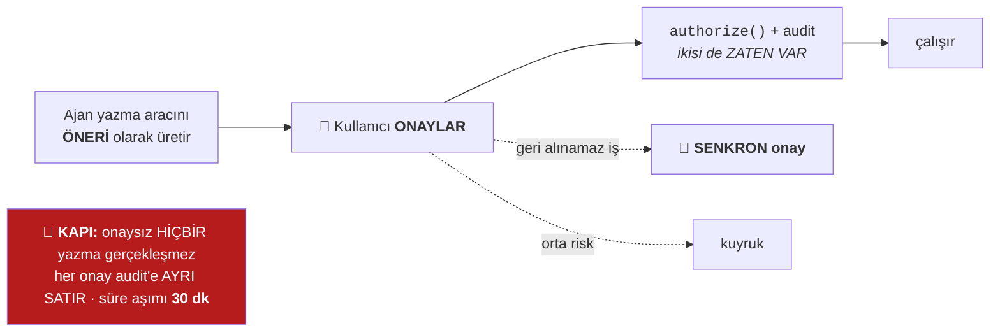

| Madde | Ne | Bayrak |
|---|---|---|
| `6.0` | 🔴 **D9 BUGÜN TERS UYGULANMIŞ — "yapılanı geri al"** | `onay_akisi` |
| `6.1` | **Onay akışı** | `onay_akisi` |
| `6.2` | **Yazma araçları** *(bugün `llm_araclari` dışında — bilerek)* | `yazma_araclari` |
| `6.3`–`6.4` | Araç kaydı genişlemesi · planlayıcı sertleştirmesi | bayraksız |
| `6.5` | Public API + async job + embed | `public_api` · `embed` |
| `6.6` | Mesajlaşma kimlik eşlemesi | `kanal_kimlik` |

## 12.4 · FAZ 7 — ARAYÜZ

| Madde | Ne | Kapı |
|---|---|---|
| `7.0` | Planın **kendi 5 iç boşluğu** kapatılır | bayraksız |
| `7.1` | ⭐ `ui_*` bayrakları **backend'e KAYDEDİLİR** | bayraksız: **değişmez** *(12 `ui_*` bugün yalnız frontend'de)* |
| `7.2` | Tasarım sistemi | **görsel regresyon kapısı** |
| `7.4` | Panel/katman disiplini — **24 kural** | `K5` |
| `7.5` | **a11y — 10 kural** | kapı |
| `7.6` | **Responsive — 3 kademe** | `V-2` |
| `7.8` | ⭐ **Ayırt edicileri GÖRÜNÜR KIL** + güven yüzeyleri | `ui_kanit_gorunurlugu` |
| `7.9` | **Mock silme kapısı** | bayraksız |

## 12.5 · FAZ 8 — AÇILMA

| Madde | Ne | Not |
|---|---|---|
| `8.1` | 🔴 **GERÇEK KULLANIM PENCERESİ** | **KOD DEĞİL.** 1-2 gerçek kullanıcı, 2-4 hafta, **≥300 gerçek tur**. 🔴 **FAZ 1'den sonra AÇILIR, FAZ 2-7 boyunca AÇIK KALIR** |
| `8.2` | → **FAZ 3.0'a taşındı** | kütük |
| `8.3` | Çok-worker dağıtım | `gunicorn 4 worker` duman testi |

> 🔴 **`KAT-3`'ün ikinci ihlali buydu:** `8.1` en sondaydı → **~130 madde hiçbir gerçek
> kullanıcı görmeden inşa ediliyordu.** Planın kendi doktriniyle *(“kusuru önce ÖLÇ”)*
> çelişen tek büyük yapısal karardı.
>
> **Ön koşul:** `1.1` (`motor_rls=shadow`) + `1.3` (yetki) + `1.3b` (`enforce_query`) +
> `1.8` (audit). **RLS'in `on` olması gerekmez** — gölge mod ölçer, engellemez.
> 🔴 **Kapı:** FAZ 5'e girildiğinde `interaction_log`'un *"kendi denemelerimiz"* payı **<%50**.

## 12.6 · §G — AJAN KATMANI *(v1'e paralel)*

| Madde | Ne | Bayrak | Not |
|---|---|---|---|
| **`AJ0`** | 🔴 **KISA DEVRE YASAĞI** — MIMARI §5'in **18. yasağı** | bayraksız: **değişmez** | 🔴 **ÖNCE BU İNER** — yazım-benzerliği chip'i merdiveni **kesiyor** |
| `AJ0b` | ⭐ **DİYALOG YÖNETİCİSİ** — atlanmış katman | `diyalog` | §G'nin ilk maddesi |
| `AJ1` | ⭐ **İddia kapısı** — `app/iddia.py` | bayraksız | **B'nin ÖN KOŞULU** · *"olmayan yetenek vaadi"* |
| `AJ2` | ⭐ **CubeQuery formdan DİLE** — `referans` bileşimsel alanı | `referans_dili` | `KAT-5`'in cevabı |
| `AJ3` | ⭐ **Turu LLM yönetir** — ikinci yürütücü | `tur_yoneticisi = deterministik\|ajan` | |
| `AJ3b` | ⭐ 🔴 **ÇALIŞIRKEN SORMA** | `calisirken_sorma` | SSE'ye **`soru` olayı** · `AskJob.status`'a **`awaiting_input`** |
| `AJ4` | Oturumlar-arası süreklilik | `oturumlar_arasi_hafiza` | |
| `AJ5` | ⭐ **Planlayıcıyı AÇ ve ÖLÇ** + araç yüzeyi | `agent_plan_secimi` | **kuzey yıldızının A'sı** |
| `AJ5b` | ⭐ 🔴 **ADIM ZİNCİRİ** — planlayıcı araç **seçiyor**, adımları **bağlamıyor** | `adim_zinciri` | |
| `AJ6` | **Bileşik rapor artefaktı** | `bilesik_rapor` | **kuzey yıldızının C'si** |

---

# 13. Bilinen kırıklar ve açık borçlar

## 13.1 · 🔴 Bugün açık — v1'i bloke edenler

| # | Ne | Etki | Nerede kapanır |
|---|---|---|---|
| 1 | 🔴 **36 çağrı sitesi `principal` geçmiyor** | **`motor_cls=on` KİLİTLİ** — kapı engelliyor | FAZ 1.2 |
| 2 | 🔴 **`AJ0` typo kısa devresi** | Ölçüldü: 13 turun **4'ü** planlayıcıya sıra gelmeden ölüyor. Korpusta `acik borc` → *"«cari borc» mi?"* → **Discovery'ye hiç gidilmiyor**. `KAT-2` ihlali | §G / `AJ0` |
| 3 | 🔴 **`app/iddia.py` YOK** | *"olmayan yetenek vaadi"* uydurulabilir — **tek kapatılmamış uydurma** | `AJ1` |
| 4 | 🔴 **`R11` yok** | *"ifade edemiyorum"* ≠ *"anlamadım"* → **eksik yetenek sayılamıyor** | v1 |
| 5 | 🔴 **Ölü bayrak 2** | `ask_async_discovery` · `threaded_chat` kayıtta var, YAML'de yok | §C/10 |
| 6 | 🔴 **`ask()` = 1147 satır / 19 iç fonksiyon** | Katmanlar bu monolitin **etrafında** oluşuyor, içinde değil | tavan kapısı `0.21` |
| 7 | 🔴 **7 güvenlik kontrol noktası, tek cümlelik sınır tanımı YOK** | `guard_sql` · `strict_sql_policy` · `always_filter` · **Katman B** · RLS · CLS · `pii` — her biri gerekçeli ama **bileşke** yazılı değil | `1.3c` yalnız `strict_sql_policy` için yazdı |
| 8 | ⚠ **`hedef_kiyasi` bayrağı kayıtta yok** | `app/hedef.py` indi ve çağrılıyor; bayrak **`FLAG_REGISTRY`'de bulunamadı** | *bu belgenin kendi ölçümü — **kaynağı koş**, bkz. §7.3* |
| 9 | ⚠ **`docs/adr/` — 20 kimlik, 252 atıf, 0 dosya** | 🔴 **ADR-0007-K3, §C'nin 3. çıkış ölçütünü taşıyor** — yani v1'in kırmızı çizgisi **var olmayan bir belgeye** dayanıyor | `4.6` |

## 13.2 · Yinelenen kusur sınıfları — bu operasyonda ölçüldü

```
┌─ 1 · "beyan var, kod onu tanımıyor" ──────────────────────────────────┐
│    capa_zinciri: coz() doğru kuralı üretiyordu, zincir onu OKUMUYORDU │
├─ 2 · "kimlik asimetrisi" ─────────────────────────────────────────────┤
│    kural bir dalda vardı, kardeşinde yoktu                            │
├─ 3 · "aynı kuralın iki sahibi" ───────────────────────────────────────┤
│    netlestirme_onceligi kararı hem YAML yorumunda hem MIMARI'de       │
├─ 4 · "ölçüm aracının kendisi de bir bağımlılıktır" ───────────────────┤
│    faz0_taban host'ta 1806, konteynerde 2056 sayıyordu → artık ⊘ yazıyor│
├─ 5 · 🔴 "testler METNİ ölçtü, davranışı değil" ───────────────────────┤
│    BU OPERASYONDA 10 KEZ. Hepsi AST/yapısal kontrole çevrildi.        │
│    ⟳ sayacı kendi paragrafını saydı · tavan testi kendi assert'ini    │
│    yakaladı · _IPTAL araması DURUM_IPTAL sabitinin ADINI yakaladı     │
└───────────────────────────────────────────────────────────────────────┘
```

## 13.3 · ContextVar deseni — 3 kez kanıtlandı

```
llm._llm_usage_var  ·  cube_router._reddi_var  ·  mali_takvim._ay_var

   derin fonksiyon OKUR  ←  sığ fonksiyon YAZAR  ←  imzalar DEĞİŞMEZ
```

---

# 14. Frontend yüzeyi — 13 panel · 36 bileşen

## 14.1 · Panel envanteri *(§C/11 · tanım B = export)*

| # | Panel | Dosya | Tükettiği uç |
|---|---|---|---|
| 1 | `ChatPanel` | `ChatPanel.tsx` | `/ask` · `/ask/jobs` · `/cube` |
| 2 | `ReportPanel` | `ReportPanel.tsx` | — *(kart konteyneri)* |
| 3 | `SchemaPanel` | `SchemaPanel.tsx` | `/schema` · `/metrics` · sahiplik |
| 4 | `DashboardsPanel` | `DashboardsPanel.tsx` | `/dashboards` |
| 5 | `SchedulesPanel` | `SchedulesPanel.tsx` | `/schedules` |
| 6 | `ReviewPanel` | `ReviewPanel.tsx` | terfi kuyruğu + **KapanisOrani** |
| 7 | `HistoryPanel` | `HistoryPanel.tsx` | sohbet geçmişi |
| 8 | `DrillDownPanel` | `DrillDownPanel.tsx` | `/ask/drill` |
| 9 | `ContractDetailPanel` | `ContractDetailPanel.tsx` | Query Contract makbuzu |
| 10 | `ConnectionReviewPanel` | `ConnectionReviewPanel.tsx` | bağlantı + **Ossie ithal adımı** |
| 11 | `HelpPanel` | `HelpPanel.tsx` | — |
| 12 | `NotificationsPanel` | ⚠ **`NotificationsBell.tsx` içinde** | bildirimler |
| 13 | `TercihlerPanel` | `TercihlerPanel.tsx` *(`export default`)* | `/tercihler` |

> 🔴 **Tavan: 13 export.** Bölüm II'de **15** (PK-23).
> ⚠ `facetPanelValues` *(`lib/chart.ts`)* bir **yardımcı fonksiyondur, panel değildir** —
> kapının regex'i `function [A-Za-z]+Panel` **sonu** ile sınırlıdır.

## 14.2 · Arka-ön entegrasyon değişmezi

```
🔴 Bir backend yeteneği, FRONTEND TÜKETİCİSİ OLMADAN "bitti" DEĞİLDİR.
   Yetim uç  =  CI HATASI       (test_uc_yetim_degil)
   Yetim alan =  CI HATASI      (test_cevap_alani_yetim_degil)
   Yeni özellik  YENİ PANEL DOĞURMAZ  (tavan 13)
```

**Ölçülmüş iki kez tekrarlanan kusur:**

| # | Ne oldu | Kullanıcıya sonucu |
|---|---|---|
| `0.23` | **Ölü render dalı** — `ReportPanel` kapısı *"raporlanabilir mi"* + *"render edilebilir mi"* **iki iş** yapıyordu | **Ödenmiş üç özellik EKRANDA YOKTU** |
| *(aynı sınıf)* | FAZ H'nin *"Onayla"* kartı aynı kapının arkasındaydı | **Onayla düğmesi HİÇ ÇIKMIYORDU** |

**Düzeltme deseni — `KAT-5`:** *gövde alanları **sayılmaz**; **saf-not** (yalnız açıklama)
kapatılır.* Unutulan bir gövde alanı **sessiz** kayıptı; şimdi **görünür** gerileme üretir.

---

# EK · Tek bakışta komut kartı

```bash
# ── GELİŞTİRME (sinyal, kapı değil) ────────────────────────────────
python lab/kapi.py --hizli --degisen app/eylem.py tests/test_eylem_onayi.py

# ── DEMET SONU (yerel kapı = YALNIZ KORPUS, 1 dk 50 sn) ────────────
python lab/kapi.py --tam
python lab/kapi.py --tam --sadece korpus     # yalnız kırmızı olanı

# ── GECELİK CI (dört adım, 4 dk 06 sn — YERELDE ASLA) ──────────────
python lab/kapi.py --hepsi

# ── ÖLÇÜM ALETLERİ ─────────────────────────────────────────────────
python lab/faz0_taban.py                     # §C 1a…12 taban
python lab/nl_corpus.py --kapi               # korpus
python lab/nl_accuracy.py --ab <bayrak>          # GERİLEME
python lab/nl_accuracy.py --ab-kurtarma <bayrak> # KAZANÇ
python lab/risk_kapsam.py                    # risk-kapsam eğrisi
python lab/sharding.py --tur 5               # çok-turlu benchmark
python lab/mdl_diff.py                       # gölge derleme diff
python lab/r1_envanteri.py                   # R1 envanteri
python lab/telemetri_envanteri.py            # FAZ 8.1 kapısı
python lab/bayrak_profilleri.py              # profil ölçümü

# ── CANLI (kota: 10 sn / 10 istek · Intent turu = 3 çağrı) ─────────
python lab/deneyim.py --live
python lab/konusma_senaryolari.py --live
```

---

# 15. DENETİM — bu belgenin kendi eksikleri *(ölçüldü, kapatıldı)*

Belge kendi iddiasına karşı tarandı: **26 kavramın 12'si eksikti**. Altısı v1 tarafındaydı
ve aşağıda kapatıldı; kalan altısı Bölüm II'ydi → **§16–§17**.

| # | Eksikti | Kapatıldı |
|---|---|---|
| 1 | `/ask/contribution` ucu | §15.1 |
| 2 | SSE akışı + `AskJob` durum makinesi | §15.2 |
| 3 | Eskalasyon *(1.10)* + kademeli düşüş *(1.11)* | §15.3 |
| 4 | `db_introspect` / tenant açılış zinciri *(3.0)* | §15.4 |
| 5 | **FAZ 0 ve FAZ 1 özeti** — §12 yalnız 4→8'i kapsıyordu | §15.5 |
| 6 | **Uç envanteri (66 uç)** + konuşma türü / takip sınıfı **adları** | §15.6 |

## 15.1 · `/ask` dışındaki cevap yolları — hepsi `seal()`'dan geçer


**`/ask/contribution` — `contribution.py`:** *"toplam neden değişti"* sorusunu **PVM
ayrıştırmasıyla** (fiyat · miktar · karışım) cevaplar. 🔴 **Kapısı:**
`ayristirilabilir_mi` — **`AVG`/oran ölçüsü ayrıştırılamaz** *(matematiksel olarak yanlış
olurdu)* → dürüst red. *Bu fonksiyon v2'de `II-D.2`'nin tahmin motoru tarafından **birebir
aynı** çağrılacak.*

## 15.2 · Arka plan işi + SSE — `AskJob` durum makinesi

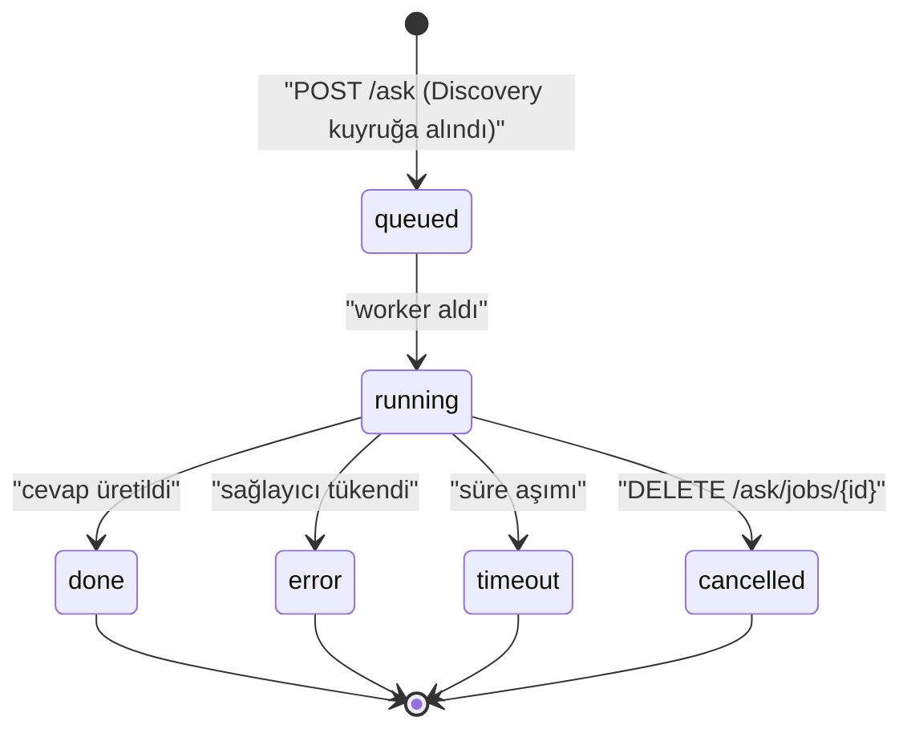

**SSE olayları** (`GET /ask/jobs/{job_id}/stream`): `adim` · `tamam` · `hata` · `zaman_asimi`

> 🔴 **`KAT-5` ihlali burada duruyor ve `AJ3b`'de kapanacak:** SSE olay kümesinde **`soru`
> yok**, `AskJob.status`'ta **`awaiting_input` yok**. Yani ajan *"başlıyorum… bu arada şunu
> anlamadım"* **diyemez** — sorabilmesi için **yeni bir olay + yeni bir durum** gerekiyor,
> ki bu tam olarak *"sayılan küme, her yeni anlam için kod ister"* deseni.
>
> ⚠ `recover_stale_ask_jobs()` — süreç yeniden başladığında **asılı kalmış** işleri
> kurtarır *(`ask.py:1249`)*.

## 15.3 · Eskalasyon *(1.10)* + kademeli düşüş *(1.11)* — FAZ 1'in son iki maddesi

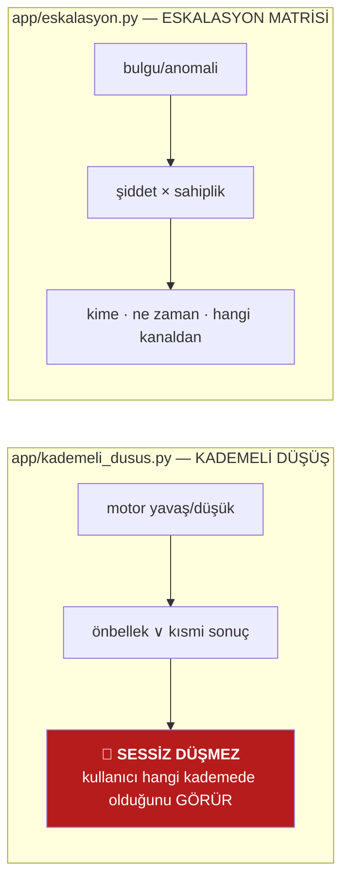

**Değişmez:** düşüşün kendisi **cevabın rozetine** yansır — *"süssüz ama doğru"* ilkesinin
altyapı karşılığı. **v2'de `II-F.6`'nın görev motoru** `eskalasyon`'u **ikinci tüketici**
olarak kullanır *(30 gün cevapsızlık → ağırlık düşür + eskalasyon)*.

## 15.4 · Tenant açılış zinciri *(FAZ 3.0)* — `db_introspect` → ilk cevap

```
  müşteri bağlantısı        POST /test  ·  POST /{cid}/confirm
        ↓
  db_introspect             tablo · kolon · FK · kardinalite taraması
        ↓
  coldstart.oner()          🚩 metrik ADAYI üretir  —  🔴 ASLA otomatik canlıya çıkmaz
        ↓                      (ADR-0018: "adaylar otomatik canlıya çıkmaz")
  ReviewPanel               insan ONAYLAR
        ↓
  packs/companies/<slug>    şirket katmanı yazılır
        ↓
  materialize() → compose() → mdl.json → WrenEngine
        ↓
  🎯 İLK DOĞRU CEVAP        ← §C/14: "insan-saat ölçülür ve YAYIMLANIR"  [ÖLÇÜLMEDİ]
```

> Bu zincir **v2'nin `II-F.8`'inin (şirket profili) doğrudan ön koşuludur** — ve
> `II-F`'nin *"SOR değil TÜRET"* stratejisi tam olarak bu zincire binecek.

## 15.5 · FAZ 0 → FAZ 3 — inen maddeler *(§12 yalnız 4→8'i kapsıyordu)*

| Faz | Adım | İnen ana maddeler | Kapanış |
|---|---|---|---|
| **−2** | — | belge onarımı *(kod yok)* | ✅ |
| **−1** | — | `MIMARI.md` ön hazırlık · `⟳ YÜRÜRLÜKTE` indeksi · **13 tuzak KAPIYA çevrildi** | ✅ |
| **0** | 11 adım | `0.22` bloklayıcı hata · `0.2` planlayıcı makbuzu · `0.23` **ölü render dalı** · `0.1` yeniden ölçüm · `0.16` ölçüm bütçesi · `0.14` **beş entegrasyon kapısı** · `0.19` semantik payda · **`0.18` METRİK KAYDI = HAKEM** · `0.5` **çapa zinciri uyandı** · yetimler *(0.3·0.7-0.11)* · `0.12`·`0.13`·`0.6` · `0.10b` **görünen adlar** · `0.15` **CI kapıları** | ✅ **§C/8 hedefe ulaştı** |
| **1** | ~19 madde | `1.1` motor-RLS · `1.1b` **arka plan işi kimliksiz koşmaz** · `1.2`/`1.2b` CLS + `llm_guard.safe_call` · `1.3` **yetki granülerliği** · `1.3b` **`enforce_query` — beyan edilmiş ama BOŞ katman** · `1.3c` *`strict_sql_policy` güvenlik sınırı DEĞİLDİR* · `1.4` süreç-arası kilit · `1.5` sertifikasyon · `1.6` lineage · `1.7` tazelik · `1.8` audit · `1.9` numeric fidelity · `1.10`+`1.11` eskalasyon + kademeli düşüş · `1.12` **AI Act / NIST / ISO 42001** · `1.13` düşman denetim paneli | ✅ *(🔴 `motor_cls=on` **KİLİTLİ** — §13/1)* |
| **2** | 13 adım | `2.1a-d` **çekirdek katman + grain sözleşmesi** · `2.2b` metrik kaydı yüzeyi · `2.3` **departman = MERCEK** · `2.4` aynı-grain çifti · `2.5` **hedef kıyası** · `2.6` **mali takvim** *(sessiz-yanlış kapandı)* · `2.7` adlandırma sözleşmesi · **borç #11** grain-farkında geçiş | ✅ |
| **3** | 7 adım | `3.1` sahiplik turu *(🔴 **ÖLÇÜM geri aldırdı**)* · `3.1b` **pack ÖNERİR, tenant UYGULAR** · `3.2` R1 envanteri · `3.3` terfi kapanış oranı · `3.4` **Ossie ithali** · `3.5` yeni kaynaklar *(⊘ ölçülemedi)* · `3.6` **cold-start + görünmez kolon** | ✅ |

## 15.6 · Uç envanteri + adlar

**66 HTTP ucu · 16 router.** *(`grep -rhoE '@router\.(get|post|put|delete|patch)'`)*

| Router | Uç sayısı | Öne çıkan |
|---|---|---|
| `ask` | 12 | `/ask` · `/cube` · `/report` · `/ask/drill` · `/ask/contribution` · `/ask/jobs/*` |
| `dashboards` | 8 | `/dashboards/{did}/data` |
| `measures` | 7 | `/candidates/*` — terfi kuyruğu · **`/blast-radius`** |
| `connections` | 6 | `/test` · `/{cid}/confirm` · **`/{cid}/import-semantic`** *(Ossie)* |
| `schedules` · `contracts` · `metrics` · `tercihler` · `conversations` · `decisions` · `stats` · `query` · `audit_export` · `eylem` · `health` | 33 | `/contracts/{cid}/replay` · `/audit/export` · `/gecikme` |

**Konuşma türleri — bugün 5, v1 hedefi 7** *(`app/followup.py`)*:

```
TUR_NEDEN · TUR_NORMAL · TUR_NE_YAPMALI · TUR_ISARET · TUR_ANLAT
                     ┊
   v1'de +2:   tur_takip (5.1)  ·  tur_paylas (5.2)
   v3'te +1:   TUR_GOREV_OLUSTUR (II-F.6) — 🔴 motoru orada doğuyor
```

**Takip sınıfları — 3** *(`followup.py:60-62`)*: `SINIF_YAPISAL` *(sorguyu düzenle)* ·
`SINIF_KONUSMA` *(cevabın üstünde konuş)* · `SINIF_YENI` *(yeni konu)*

---

# 16. 🔴 v2'de NE EKLENECEK — bölüm bölüm delta

**v2 = `II-D` (analist) + `II-E` (karar) + `II-F`'nin dört maddesi.**
*Bu bölüm yeniden anlatmaz — yukarıdaki her §'a **ne eklenir** onu yazar.*

## 16.0 · v2'nin üç ön koşulu — hiçbiri atlanamaz

| # | Şart | Bugünkü durum |
|---|---|---|
| 1 | **v1 kapanmış** — §C'nin **16** ölçütü yeşil | 🔴 **4'ü `[ÖLÇÜLMEDİ]`** (§11.2) |
| 2 | **FAZ 8.1 koşulmuş** — Plan 3 §1.4: *"onsuz başlamaz"* | 🔴 **pencere açılmadı** |
| 3 | **§II-0'ın 9 maddesine KARAR BAĞLANMIŞ** | 🔴 **hiçbiri işaretli değil** |

> 🔴 **DÖNGÜ DÜZELTMESİ — v2 ASLA BAŞLAYAMAZDI.** Kapı önce *"11 madde **teyitli**"*
> istiyordu; ama `E1` düzeltmesi *"talep gözlenmezse madde **`[TEYİT ALINMADI]`** olarak
> **AÇIK KALIR**"* diyor. İkisi birlikte: **madde talep görmez → asla teyitli olmaz →
> şart asla sağlanmaz → v2 asla başlayamaz.** §C/9'un kilidiyle **aynı sınıf**.
>
> **KARAR:** kapı *"teyitli"* değil **"KARARI BAĞLANMIŞ"** ister. Üç durum, **ikisi geçerli**:
>
> | Durum | Sonuç |
> |---|---|
> | `[TEYİT ALINDI · <tarih>]` | madde **uygulanır** |
> | `[TEYİT ALINMADI — talep gözlenmedi · <tarih>]` | madde **uygulanmaz**, kayıt kalır |
> | *(işaretsiz)* | 🔴 pencere koşmadı → **kapı KAPALI** |
>
> **Kapıyı açan şey *"hepsi istendi"* değil, *"hepsine bakıldı"*.**
> ⚠ **Ters `KAT-3` düzeltmesi:** 11 maddenin **ikisi** (`6B.14`→II-H.1 · `6B.16`→II-H.2)
> **v3'e** aittir ve **v2'nin kapısında durmaz** → kapı **9 madde** sayar.

## 16.1 · § 2 · **Yedi katman** → v2 deltası

```
 6 · ARTEFAKT   + Karar Kaydı (16 alan) · Karne · CEO Günlüğü · Senaryo
 5 · ANLAMA     + LLM: seçenek METNİ · SWOT MADDE metni  🔴 SINIFI ASLA
 4 · DİYALOG    + karar derinlik merdiveni  hizli_3 | tam_9  (soruya bağlı)
 3 · YÜRÜTME    + ForecastContract · Senaryo overlay (DEĞİŞMEZ)
 2 · DİL        + Graf (SurucuDugumu · kenar: arithmetic | causal)
 1 · ANLAM      + ŞirketBaglami · SurecAdimi · SozlukTerimi · ŞirketProfili
 0 · GÜVENCE    + imzalayan_id NOT NULL & İNSAN · PolitikaKurali (kırmızı çizgi)
```

🔴 **Yeni katman EKLENMİYOR** — yedi katman **aynı kalıyor**, her birine içerik biniyor.

## 16.2 · § 4 · **Prompt akışı** → v2'de merdivene ne eklenir

**Merdiven basamakları DEĞİŞMEZ.** Eklenen şey `seal()`'ın **sonrası** ve chip'lerin
**hedefi**:

| Nerede | v2'de eklenir |
|---|---|
| **`seal()` çıkış kapısı** *(§4.3)* | 🔴 **`II-E`'nin ZORUNLULUĞU:** *"Karar Motoru kendi bounded-context'i olduğu için `seal()`'ı **atlaması en olası yer**"* → **her karar çıktısı `seal()`'dan geçer**. `tests/test_kapanis_zinciri.py` **genişletilir** |
| **`next_steps` chip'leri** | + *"bunu tahmin et"* · *"what-if kur"* · *"karara dönüştür"* |
| **Discovery dalı** | değişmez — ama `II-D.1`'in grafı `DrillDownPanel`'i **strangler fig** ile devralır *(bayrak `off` → bugünkü yol **birebir**)* |
| **Bağlam çözümü** *(§4.1)* | + `II-F.8` **bağlam enjeksiyonu ~800 token** *(öncelik: sektör > departman > kritik metrik)*. 🔴 **Çelişkide VERİ KAZANIR** — profil bir **yorumdur**, `route()`'un sayısı **gerçektir** |

## 16.3 · § 7 · **Bayrak envanteri** → v2'de eklenen 12 bayrak

| Bayrak | Madde | Ne açar | 🔴 `GERİ AL` yazılı mı? |
|---|---|---|---|
| `ui_nedensellik_grafi` | `II-D.1` | **TEK graf, ÜÇ tüketici** *(what-if · kök-neden · açıklanabilirlik)* | ✅ *(off → `DrillDownPanel` birebir)* |
| `ui_tahmin` | `II-D.2` | **ARALIK ZORUNLU** tahminleme | ❌ **EKSİK** |
| `ui_what_if` | `II-D.3` | Senaryo = **DEĞİŞMEZ overlay** | ❌ **EKSİK** |
| `ui_kohort` | `II-D.4` | Kohort ısı haritası — **5 zorunlu parametre** | ❌ **EKSİK** |
| `ui_karne_karti` · `ui_swot_karti` | `II-D.5` | Karne + SWOT *(kompozisyon, yeni hesap YOK)* | ❌ **EKSİK** |
| `ui_departman_podlari` | `II-D.9` | Departman podu + **sorumluluk sınırı** | — |
| `ui_ceo_gunlugu` | `II-D.11` | Raporun **TEMATİK** varyantı | ❌ **EKSİK** |
| `ui_karar_motoru` | `II-E.1-3` | Çerçeve · seçenek · **9 kriterlik havuz** | ❌ **EKSİK** |
| `ui_karar_kaydi` | `II-E.7` | `DecisionRecord` **16 alan** | ❌ **EKSİK** |
| `ui_is_baglami_sihirbazi` · `ui_is_baglami_kartlari` | `II-F.1` | İş bağlamı kütüğü | ❌ **EKSİK** |
| `ui_kurumsal_takvim` | `II-F.3` | Ay-sonu kapanış · sezon · bütçe dönemi | ❌ **EKSİK** |

> 🔴 **ŞABLON DENETİMİ — BÖLÜM II HİÇ TARANMAMIŞTI** *(ölçüldü @`8f87e40`)*:
> **18 bayraklı maddenin 17'sinde `GERİ AL` bloğu YOK.**
> Kök neden **tam olarak `KAT-5`**: denetim betiğinin deseni `^### ([0-9]+\.[0-9]+|AJ[0-9])`
> idi ve **`II-D.1` biçimini kapsamıyordu** → araç *"33/33 TAM"* raporladı.
> *Sayılan her küme, kapsamadığı her şeyi görünmez kılar.*
>
> **İki bağlayıcı karar:** ① kapı düzeltilir, **17 blok ŞİMDİ YAZILMAZ** *(uydurmak ölü
> doğuş olurdu)* · ② 🔴 **hiçbir Bölüm II maddesi, altı bloğu TAM olmadan SIRAYA ALINMAZ.**

## 16.4 · § 8 · **Manuel test** → v2'de elle bakılacak yeni şeyler

| Yetenek | 1 · Kazanç | 2 · **Kırmızı çizgi** | 3 · Gizli risk |
|---|---|---|---|
| **Tahmin** `II-D.2` | *"İleride ne olur?"* cevaplanır | 🔴 **ASLA tek sayıyla** — `alt·orta·ust` + `guven_notu` *(skaler DEĞİL)*. **Nominal "%95 güven aralığı" İDDİA EDİLMEZ** | **`AVG`/oran ölçüsünü** aggregate tahmin edip bileşene bölmek **matematiksel olarak yanlış** → `contribution.ayristirilabilir_mi` **birebir aynı fonksiyon** çağrılır |
| **What-if** `II-D.3` | Sürücü grafında override → aşağı akış | 🔴 **Overlay, ASLA mutasyon** · döngü **YAZMA anında** reddedilir | *"sürücü ekle / formül tanımla"* **yalnız insan formuna açık** — LLM önerisi buraya **asla yazmaz** |
| **Kohort** `II-D.4` | Isı haritası + olgunluk maskesi | 🔴 **`min_kohort_buyuklugu=30` altında üretilmez** · **boş hücre UYDURULMAZ** | **GENEL normalizasyon varsayılan** — Mixpanel'in *"her satır kendi içinde iyi görünür"* yanıltıcılığı **reddedilir**; ham yüzde **HER ZAMAN görünür** |
| **Karne + SWOT** `II-D.5` | 6 kritik metrik, **TEK BAN cümlesi** | 🔴 **LLM yalnız madde METNİNİ yazar, SINIFI değil** · SWOT maddesinin `contribution` bulgusuna **ZORUNLU FK'si** | Karne **kendi sorgusunu yazmaz**, kayıtlı araçları çağırır |
| **Kanıt matrisi** `II-E.4` | `VERİ ∣ VARSAYIM ∣ BİLİNMİYOR` | 🔴 **`BİLİNMİYOR` GİZLENEMEZ — boş hücre YOKTUR** | Bir kararın **ne kadarının veriye dayandığı** ilk kez sayılabilir |
| **Karar kaydı** `II-E.7` | 16 alan, append-only | 🔴 **`imzalayan_id` NOT NULL ve İNSAN** · `is_agent=False` doğrulaması · **otomatik uygulama YOK** | 🔴 **İKİ AYRI SKOR, ASLA TEK SAYIYA KARIŞMAZ:** Karar Kalitesi *(süreç, **en-zayıf-halka** — ortalama DEĞİL)* ⟂ Sonuç Skoru *(ufuk dolunca)*. Toplamak **öğrenmeyi imkânsız** kılar |
| **Kırmızı çizgi** `II-E.9` | Kod-seviyesi kısıt | 🔴 **Ajan kırmızı çizgiyi ÖNEREMEZ BİLE** | `Principal.is_agent` + `PolitikaKurali` |
| **İş bağlamı** `II-F.1` | Şirketi tanır | 🔴 ***"Bilmiyorum" üçüncü seçeneği ASLA varsayım üretmez*** → `belirsiz` + Bakım Ajanı | **Mekanizma iner, kimse doldurmaz** riski → *"SOR değil **TÜRET**"* |
| **Şirket profili** `II-F.8` | ~800 token bağlam enjeksiyonu | 🔴 **`otomatik_taslak` profil, kullanıcı ONAYLAMADAN LLM prompt'una ENJEKTE EDİLMEZ** | ADR-0018'in *"adaylar otomatik canlıya çıkmaz"* kuralının **hafıza eksenindeki** karşılığı |

## 16.5 · § 9 · **A/B** → v2'nin ölçüm kapıları

| Yetenek | Kapı | Eşik |
|---|---|---|
| Tahmin | **dört sınır-değer testi** | **<12 ay → tahmin YOK** · **MASE ≥ 1.0 → YAYIMLANMAZ** · 2-11 satır → `seasonal_naive` · Holt-Winters min `m+5` *(aylık **17 nokta**)* · **kısmi son dönem DIŞLANIR** |
| What-if | `test_senaryo.py` | graf versiyonu değişince senaryo **`yeniden_dogrulama_gerekli`**'ye düşer |
| Kohort | `test_kohort.py` | a11y: metin **~%40 doygunluk üstünde beyaza döner** · min opaklık **~%10** |
| Kanıt matrisi | `test_kanit_matrisi.py::test_bos_hucre_yok` | boş hücre **0** |
| Karar kaydı | `test_karar_kaydi.py` | iki skor **ayrı alanlarda** ve **birleştiren kod YOK** *(kaynak taraması)* |
| Kriterler | `test_karar_kriterleri.py` | 🔴 **seçenek üretildikten SONRA ağırlık değişimi REDDEDİLİR** · toplam **100** |
| Kırmızı çizgi | `test_kirmizi_cizgi.py` | `is_agent=True` ihlal eden seçeneği **üretemiyor** |
| Duyarlılık | — | kırılma noktası **İKİLİ ARAMA**: aralık `[-100%, +500%]` · tolerans **%0,5** · çözülemezse **dürüst red**. Kırılganlık: **<%5 kırılgan · %5-10 orta · >%10 sağlam** |

## 16.6 · § 14 · **Frontend** → v2'de panel tavanı

```
   v1 tavanı:  13 export          Bölüm II tavanı:  15  (PK-23)
                                                     ↑
   Yani II-D + II-E'nin TAMAMI  yalnız  +2 PANEL  ile sığmak zorunda.
```

**Bu yüzden hemen her v2 maddesi *"yeni ekran DEĞİL"* diye başlıyor:**

| Madde | Nereye biner |
|---|---|
| `II-D.1` graf | **ortak Şema/DAG bileşeni — TEK yapı, ÜÇ render modu** |
| `II-D.2` tahmin | `chart.ts`'in `referenceLine`/alan-doldurma'sı **zaten var** |
| `II-D.5` karne | **widget, yeni ekran DEĞİL** *(PK-13)* |
| `II-D.11` CEO günlüğü | 🔴 **yeni buton EKLEMEZ** *(PK-15)* — `report.compose`'un parametresi |
| `II-E.5` duyarlılık | **ayrı sayfa DEĞİL, katlanır panel** *(PK-12)* |
| `II-E.6` gradient eğrisi | **istemci tarafında** — yeni uç **YOK** *(KD-14)* |
| `II-D.4` kohort hücresi | **yeni drill modalı icat etmez** *(PK-11)* → `ContractDetailPanel` |
| `II-E.5` what-if paneli | `II-D.3`'ünkini **YENİDEN KULLANIR** |

**Tahminin görsel sözleşmesi** *(Plan 2 §9.2)*: aynı serinin **AÇIK TONU** *(kesikli çizgi
**DEĞİL** — Tableau'nun belgelenmiş kararı)* · bant kenarı **kademeli opaklık** ·
🔴 **gerçekleşmiş kısım DAHA belirgin, tahmin DAHA soluk** — *"güvene görsel ağırlık ver,
belirsizliğe değil"*.

## 16.7 · § 13 · **Borçlar** → v2'nin kendi yeni riski

| Risk | Kayıt |
|---|---|
| 🔴 **17 madde `GERİ AL`'sız** | `KURAL B`'nin **dışında** — *"geri alma yolu yazılmamış madde **geri alınamaz**"* |
| ⚠ `D5` kapısının **kendi şartnamesi kırık** | *"her `<FAZ>.<N>` atfı için bir başlık"* diyor ama **~20 madde birleşik başlıkta** yaşıyor → harfiyen koşulursa **~20 yanlış-pozitif** |
| 🔴 **SHAP KURULMAZ** | Bir kütüphanenin açıklamasını *"nedensellik"* diye sunmak, `hierarchies` kararının ihlali olurdu — **uydurulmuş nedensellik, güvenle yanlış bir yol üretir** |
| 🔴 **Prophet KULLANILMAZ** | §D.1 hükmü. Nixtla StatsForecast **~500× hızlı** `[DOĞRULANMADI]` |
| 🔴 **DMN bilinçle REDDEDİLDİ** | hit policy yalnız `II-H.2`'nin dar alanında ödünç alınır *(yazılmazsa 6 ay sonra yeniden tartışılır)* |
| ⚠ **Sistem seçenek İCAT ETMEZ** | 2-3 alternatif, geçmiş `DecisionRecord`'lardan **benzerlikle** örneklenir. Kaynak yazılmazsa **LLM'e kalır → B1 ihlali** |

---

# 17. 🔴 v3'te NE EKLENECEK — bölüm bölüm delta

**v3 = `II-F`'nin kalanı + `II-G` (ölçek/öğrenme) + `II-H` (dış bağımlılıklı spike'lar).**
Bittiğinde: **çekirdek ürün %100.**

## 17.1 · § 2 · **Yedi katman** → v3 deltası

```
 6 · ARTEFAKT   + Sabah brifingi · Terfi kuyruğu (4 kaynak TEK ekran) · Kredi paneli
 5 · ANLAMA     + Sistem copilot (NL → yapılandırılmış MUTASYON)  🔴 onay_akisi'nın 5. tüketicisi
 4 · DİYALOG    + 8. konuşma türü TUR_GOREV_OLUSTUR + TAAHHÜT YAKALAMA
 3 · YÜRÜTME    + çift önbellek (security_context_hash anahtarın parçası) · derleme_grubu
 2 · DİL        + PaketOverride · semantik model VERSİYONLAMA (3 okuma-anı durumu)
 1 · ANLAM      + HafizaKaydi (TEK tablo, 4 tip × 7 katman) · UrunKarti/BOM · Gorev
 0 · GÜVENCE    + Anayasal kalkan (Z3, build-time) · Departman hakemi (CP-SAT)
```

## 17.2 · § 4 · **Prompt akışı** → v3'te ne değişir

| Nerede | v3'te eklenir |
|---|---|
| **Bağlam çözümü** *(§4.1)* | + **hafıza getirme** — 🔴 **dört ayrı `getirme_stratejisi`**: `semantik`→ad-eşleşmesi · `epizodik`→zaman-aralığı · `prosedürel`→direkt-okuma · `tercih`→benzerlik |
| **🔴 DEĞİŞMEZ** | ***hafıza ölçü/cube seçimine ASLA karışmaz.*** Bu kural **zaten yazılı**: `SunumTercihi`'nin *"tercih **ÖLÇÜ/CUBE SEÇİMİNE KARIŞMAZ**"* + *"**SESSİZ** uygulanmaz"* daraltması **`II-F.9`'un tamamına** uygulanır |
| **Öncelik çözücü** | 🔴 **`coz_oncelik()`** — `tercih` → **KİŞİ** kazanır · `tanım` → **ŞİRKET** kazanır · `kural` → **POLİTİKA** kazanır. Yani *"net satış"* tanımını **kimse kişisel tanımla EZEMEZ**. ⚠ *Sürüm 1 "en spesifik kazanır" diyordu ve **kuralı tersine çeviriyordu**.* Çelişki **sessizce çözülmez** — loglanır ve **UI'a taşınır** |
| **Merdiven** | değişmez — ama **`0 kredi`** kuralı buraya bağlanır: **altın yol + önbellek = 0 kredi** |
| **Konuşma türü** | + **8.'si**: `TUR_GOREV_OLUSTUR` + **taahhüt yakalama** *("halledeceğim", "yarın gönderirim")*. 🔴 **Kullanıcı onayı olmadan görev ASLA otomatik oluşmaz** |

## 17.3 · § 7 · **Bayraklar** → v3'te eklenen 8 bayrak

| Bayrak | Madde | Ne açar |
|---|---|---|
| `tur_gorev` | `II-F.6` | **8. konuşma türü** + `Gorev` motoru |
| `ui_sabah_brifingi` | `II-F.7` | **5 slot, 30 saniyede okunur** — Landing'in VARYANTI *(PK-14)* |
| `ui_hakkimda_bilinenler` | `II-F.12` | Kişisel hafıza şeffaflığı + **gerçek silme** + export |
| `sektor_paketi` | `II-G.1` | **Looker Blocks deseni** *(Fabric "as-is" DEĞİL)* |
| `ui_terfi_kuyrugu` | `II-G.5` | **TEK motor, DÖRT kaynak** — `ReviewPanel`'in genellemesi |
| `ui_kredi_paneli` | `II-G.6` | `KrediHareketi` + isabet/tasarruf paneli |
| `ui_departman_hakemi` | `II-H.1` | **OR-Tools CP-SAT** — nicel çatışma **deterministik** çözülür |
| `ui_sistem_copilot` | `II-H.3` | Sohbetten ayar değişikliği **önerisi** |

*(`II-H.2` anayasal kalkanın **ayrı UI'ı YOKTUR** — KD-18.)*

## 17.4 · § 8 · **Manuel test** → v3'te elle bakılacaklar

| Yetenek | 1 · Kazanç | 2 · **Kırmızı çizgi** | 3 · Gizli risk |
|---|---|---|---|
| **Hafıza** `II-F.9` | Sistem şirketi **hatırlar** | 🔴 **hafıza ölçü/cube seçimine ASLA karışmaz** · **retrieval EKLENMEZ** *(ölçülen bant **+14/−16**: belleği kur, ama **BASİT** kur)* | 🔴 **P0 — arka kapıdan geri gelen kapsam:** hafıza kaynaklı **yalakalık başarısızlığı çoğu modelde %90'ın üstünde**; **uydurma hafıza yerleştirme %99,8'e kadar** başarılı ölçüldü → **üç zorunlu alan**: `kaynak_ifade` · `son_dogrulama` · `celiski_bayragi`. Çelişki **sessizce çözülmemeli, GÖSTERİLMELİ** |
| **Seçici yazma** `II-F.10` | Hafıza **kirlenmez** | 🔴 **Bir LLM çıktısı DOĞRUDAN hafızaya YAZAMAZ** — `sinonim_onerici`'nin `approved=False` **SABİT** *(parametre değil!)* deseni | **Altı kriter**: tekrarlayan *(≥2)* · doğrulanmış · kapsamı belirli · **PII içermiyor** *(yazma öncesi `pii.mask_text`)* · çelişki üretmiyor · kaynağı izlenebilir |
| **Unutma** `II-F.11` | Çürüme + arşiv | 🔴 **ASLA hard-delete** *(ADR-0019)* — **TEK istisna: KVKK, kullanıcının kendi kişisel hafızası** | 🔴 **Silinen kayıt SONRAKİ cevapta kullanılmıyor** — **canlı doğrulanır** |
| **Görev motoru** `II-F.6` | Bulgu → görev | 🔴 **Kökensiz görev YARATILAMAZ** — `kaynak_tip` + `kaynak_id` **ZORUNLU FK** | Aksi hâlde görev listesi kanıt zincirinden kopmuş bir **yapılacaklar uygulamasına** döner |
| **BOM / ürün kartı** `II-F.2` | Maliyet/marj/karbon **AYNI ağacı okur** | 🔴 **Derinlik sınırı ZORUNLU** | ⚠ **Kendine-referanslı ilişki + calc kolon → Rust'ta PANIC** *(`lineage.rs:146` `.unwrap()`)* ve **`except Exception` YAKALAMAZ** *(`PanicException` MRO'su)*. **Derinlik sınırı bir tercih değil, ÇÖKME KORUMASI** |
| **Terfi motoru** `II-G.5` | Dört kaynak tek kuyruk | 🔴 **`reddedildi` ≠ `ertelendi`/`deprecated`** — ikisini tek *"reddet"*e sıkıştırmak *"iyi ama zamanı değil"* adayları *"kalıcı olarak kötü"* diye kaydeder ve **kalibrasyonu bozar** | 🔴 **Karar yorgunluğu:** **50+ inceleme** `[DOĞRULANMADI]` → kuyruk **önceliklendirilir** + **toplu inceleme**. Uzun liste onaylayanı *"hepsini kabul et"*e iter |
| **Kredi** `II-G.6` | Maliyet görünür | 🔴 **Başarısız işlemde kredi YAKILMAZ** · **altın yol + önbellek = 0 kredi** | ⚠ *"önbellek = 0 kredi"* **bir önbelleğin varlığını gerektirir** — MIMARI §5'in *"sonuç cache'i bilinçle KURULMADI"* kararı **FAZ 8.1 telemetrisiyle** yeniden açılır |
| **Departman hakemi** `II-H.1` | Nicel çatışma **deterministik** | 🔴 **LLM DEĞİL** — çözücü karar verir, LLM **yalnız gerekçe metnini** yazar | **Rozet:** *"hesaplanmış uzlaşma"* ↔ *"yorumlanmış öneri"* ayrımı **kullanıcıya gösterilir**. Gizlenmez, **soluk gösterilir** *(PK-6)* — ve *"soluk ama tıklanabilir"* ile *"devre dışı"* **AYNI token'ı paylaşmaz** *(A11Y-9)* |
| **Sistem copilot** `II-H.3` | Sohbetten ayar | 🔴 **`/settings` ekranlarının YERİNE GEÇMEZ, ÜSTÜNE BİNER** *(PK-18)* | Hiçbir mutasyon **onaysız** uygulanamaz; her onay **ayrı audit satırı** |

## 17.5 · § 9 · **A/B** → v3'ün ölçüm kapıları

| Yetenek | Kapı | Eşik |
|---|---|---|
| Hafıza önceliği | `test_hafiza_oncelik.py` | `coz_oncelik()` üç ekseni **karıştırmıyor** |
| Görev kökeni | `test_gorev_kokeni.py` | kökensiz görev **yaratılamıyor** |
| BOM | `test_bom_derinlik.py` | sınır aşımında **dürüst red**, **motor ÇAĞRILMIYOR** |
| Sektör paketi | — | gölgeleme **gerekçesiz yapılamıyor** *(`sebep` ZORUNLU)* + **sapma metriği**: *"kaç şirket-katmanı satırı sektör-katmanını gölgeliyor"* → **pack drift**, ISO 42001 girdisi |
| **Terfi regresyon kapısı** | `eval/run.py` | 🔴 **Aday terfi etmeden önce golden-set YENİDEN koşulur; önceden-doğru bir cevap artık farklı çıkıyorsa terfi ENGELLENİR.** ← *"terfi motorunun kendi kalitesini bozması"* riskine karşı **tek savunma** *(kanıt: `fire` ↔ `ciro`, kosinüs **0,92**)* |
| VQR yönetişimi | — | `MetricDefinition` değişince bağlı VQR **otomatik `needs_reverification`** |
| Kredi | `test_kredi.py` | `source=cube` cevap **0 kredi** · iki farklı `security_context` → **farklı `cache_key`** |
| Departman hakemi | determinizm testi | aynı girdi → **aynı çözüm** |
| Anayasal kalkan | **build-time CI kapısı** | 🔴 çalışma zamanında Z3 çağrısı **YOK** *(gecikme eklemez)* |
| Çok-tenant | — | tenant modeli **10-40 MB** · **500+ tenant tek süreçte** `[DOĞRULANMADI]` · ön koşul **v1 FAZ 1.4** |

## 17.6 · § 12 · **Kalan yol** → v3'ün iki spike'ı ZAMAN-KUTULU

```
🔴 II-H.1 ve II-H.2  MADDE DEĞİL,  ZAMAN-KUTULU SPIKE'tır.

   ┌────────────────────────────────────────────────────┐
   │  2 hafta  ·  BİR gerçek çatışma vakası             │
   │  çözemezse  →  KAPATILIR                            │
   │  kapanırsa  →  EK J'ye GEREKÇESİYLE taşınır        │
   │                (sessizce ertelenmez)                │
   └────────────────────────────────────────────────────┘

   İkisi de [TEYİT BEKLİYOR] · P2 · bir BI ürününde DOĞRULANMAMIŞ.
   Öldürme ölçütü YAZIYA GEÇER — EK J disiplininin İLERİYE DÖNÜK hâli.
```

## 17.7 · § 15.4 · **Tenant açılışı** → v3'te *"SOR"* değil *"TÜRET"*

🔴 **Toplama stratejisi değişti.** `II-F.1`'in bugünkü yolu bir **sihirbaz** — yani
**müşteriye form doldurtmak**. Ölçülen darboğaz: *"mekanizma üretiliyor, **sözlük
üretilmiyor**."* Katalogda olan iş bağlamında da olur: **mekanizma iner, kimse doldurmaz.**

| Bağlam | Nereden **TÜRETİLİR** | Altyapı |
|---|---|---|
| Mali takvim · dönem yapısı | ERP'nin **kendi takvim tablosu** | `db_introspect` ✅ · **v1 2.6** |
| Ürün/müşteri/tedarikçi hiyerarşisi | ERP **kart tabloları** | `db_introspect` ✅ · `II-F.2` |
| Maliyet merkezi · organizasyon | **muhasebe hesap planı** | `mizan` cube'u ✅ |
| Hangi metrik **kimin işi** | **query-log madenciliği** | `II-G.3` — 🔴 **ön koşul FAZ 8.1** *(madencilik yapılacak log YOK)* |
| İş terimleri | mevcut **raporlar · prosedür dokümanları** | `sinonim_onerici` ✅ *(insan onayı)* |

> ⚠ **Sihirbaz KALDIRILMAZ:** türetilen her şey **taslak** gelir (`onay_durumu`), insan
> **onaylar**. ***Türetme, sormanın yerine geçmez — sorulacak soruyu 20'den 3'e indirir.***
>
> **Query-log madenciliği — 7 adımlı boru hattı:** ters-indeks → literal-normalizasyon →
> sıralama → yenilik kontrolü → doğrulama → 🔴 **LLM YALNIZ İSİMLENDİRME** →
> **zorunlu insan onayı**.

## 17.8 · § 14 · **Frontend** → v3'te panel tavanı ve versiyonlama

**Semantik model versiyonlama `II-G.2` — okuma anında hesaplanan ÜÇ durum:**

```
   kaydedilmiş her cevap / karar / tahmin / senaryo için:

   ┌─────────────────────┬──────────────────────┬──────────────────────┐
   │   reproducible      │  numbers_may_differ  │  definition_removed  │
   │   aynen üretilir    │  sayı DEĞİŞMİŞ OLABİLİR │ tanım KALDIRILMIŞ  │
   └─────────────────────┴──────────────────────┴──────────────────────┘

🔴 HÜKÜM: Cube'ün `schemaVersion`'ı bir CACHE ANAHTARIDIR,
          semantik sözleşme versiyonu DEĞİL.  (yanlış model almayı önler)
```

**Terfi kuyruğu görsel kuralı:** 🔴 **kategori rengi ≠ güven rengi** — dört kaynağın her
biri **sabit renk**; etki/güven **yalnız opaklık** ekseninde *(PK-13)*.

---

# 18. Tek bakışta: v1 → v2 → v3 birikimi

```mermaid
flowchart LR
    subgraph V1["v1 — 'Konuşan, kanıtlayan, güvenli şirket beyni'"]
        A1["7 katman ADLANDIRILDI"]
        A2["8 basamaklı merdiven"]
        A3["25 bayrak · 66 uç · 13 panel"]
        A4["§C'nin 16 ölçütü"]
    end
    subgraph V2["v2 — 'Analist ve karar ortağı'"]
        B1["II-D · analist<br/>graf · tahmin · what-if · kohort · karne"]
        B2["II-E · karar<br/>kanıt matrisi · karar kaydı · kırmızı çizgi"]
        B3["II-F ×4 · iş bağlamı<br/>kütük · takvim · sözlük · profil"]
    end
    subgraph V3["v3 — 'Şirketi TANIYAN, kendini GELİŞTİREN platform'"]
        C1["II-F kalanı<br/>hafıza · unutma · görev · brifing · BOM"]
        C2["II-G · ölçek<br/>sektör paketi · versiyonlama · terfi · kredi"]
        C3["II-H · spike<br/>CP-SAT · Z3 · copilot"]
    end
    V1 -->|"16 ölçüt yeşil<br/>+ FAZ 8.1 koştu<br/>+ 9 maddeye KARAR bağlandı"| V2
    V2 -->|"II-0'ın kalan 2 maddesi<br/>kendi sürümünde karara bağlanır"| V3
    V3 --> D(["**ÇEKİRDEK ÜRÜN %100**"])

    style V1 fill:#1b5e20,color:#fff
    style V2 fill:#0d3b66,color:#fff
    style V3 fill:#4a148c,color:#fff
    style D fill:#4a3f00,color:#fff
```

| | v1 | v2 | v3 |
|---|---|---|---|
| **Cevapladığı soru** | *"Ne oldu? Neden?"* | *"Ne olacak? Ne yapmalıyım?"* | *"Şirketimi biliyor mu? Kendini geliştiriyor mu?"* |
| **Katman** | 7 katman **adlandırıldı** | aynı 7 katmana **içerik biner** | aynı 7 katmana **hafıza + ölçek biner** |
| **Yeni bayrak** | 25 *(21 YAML + 4 kayıt-dışı)* | **+12** | **+8** |
| **Panel tavanı** | **13 export** | **15** *(PK-23)* | **15** — değişmez |
| **Yeni merdiven basamağı** | 8 | 🔴 **0** | 🔴 **0** |
| **En büyük risk** | *"testler METNİ ölçtü"* | 🔴 **17 madde `GERİ AL`'sız** | 🔴 **hafıza kaynaklı yalakalık %90+ · zehirleme %99,8** |

---

## 🔴 KAPANIŞ — belgenin kendi sınırı

Buradaki **her** sayı bir koşumdan alındı ve **o koşumun damgasını** taşır. Bayatladıklarında
**bu belge düzeltilmez — araç yeniden koşulur.**

Ve bu belgenin **kendisi bir kapı değildir**: kimse onu koşmaz, kırmızı vermez, kimseyi
durdurmaz. Bir şemanın doğru görünmesi, kodun öyle çalıştığı anlamına gelmez.

> **Bu belgeye dayanarak bir karar verme.**
> Kodu oku, aleti koş, sayıyı gör.
